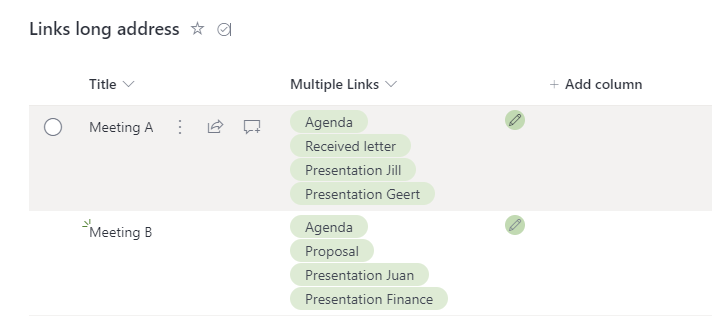

# Multiple hyperlinks in single field

## Summary
Using this sample you can have multiple hyperlinks in a single field.



## View requirements
- This format can be applied to a Multi lines of text column
- The links can to be introduced with an alternative text by preceding them with square brackets, for example, [List Formatting Samples]https://pnp.github.io/List-Formatting/ seperating each link in a new row of the multi-line column using SHIFT+ENTER
- The following is an example value
    ```
    [Microsoft 365 & Power Platform Community]https://pnp.github.io/
    [Sharing Is Caring]https://pnp.github.io/sharing-is-caring/
    [M365 Platform & Power Platform Community Recognition Program]https://pnp.github.io/recognitionprogram/
    ```

## Sample

Solution|Author(s)
--------|---------
text-multiple-hyperlinks.json | [Geert de Kooter](https://github.com/gdk-max)

## Version history

Version|Date|Comments
-------|----|--------
1.0|January 26, 2023|Initial release

## Disclaimer

**THIS CODE IS PROVIDED *AS IS* WITHOUT WARRANTY OF ANY KIND, EITHER EXPRESS OR IMPLIED, INCLUDING ANY IMPLIED WARRANTIES OF FITNESS FOR A PARTICULAR PURPOSE, MERCHANTABILITY, OR NON-INFRINGEMENT.**

---

## Additional notes
None

