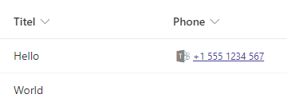

# Call phone number with Teams

## Summary
Display a phone number stored in a string column as a link to initiate a Microsoft Teams call.

## View requirements
- Apply to *single line of text* columns (string)

## Sample

Solution|Author(s)
--------|---------
text-phonenumber-teams-call.json | [Hagen Deike](https://github.com/samurai-ka) ([@samurai@sueden.social](https://sueden.social/@samurai))

## Version history

Version|Date|Comments
-------|----|--------
1.0|February 16, 2024|Initial release

## Disclaimer

**THIS CODE IS PROVIDED *AS IS* WITHOUT WARRANTY OF ANY KIND, EITHER EXPRESS OR IMPLIED, INCLUDING ANY IMPLIED WARRANTIES OF FITNESS FOR A PARTICULAR PURPOSE, MERCHANTABILITY, OR NON-INFRINGEMENT.**

---

## Additional notes
- Empty fields do not show a Teams icon.
- No syntax checking for phone numbers. What every you enter in the field will be used to initiate the Teams call.

