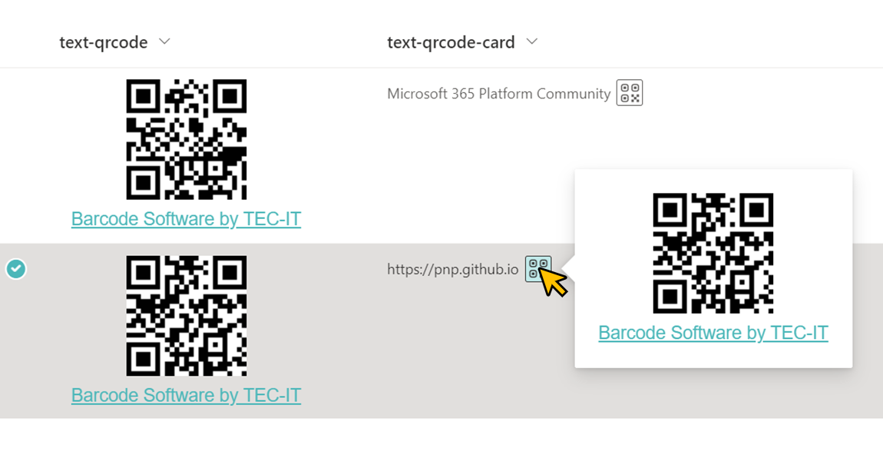

# Display QR Code

## Summary
This sample demonstrates the use of [TEC-IT's service](https://barcode.tec-it.com/QRCode) to convert column value text into a QR code and display it.

## View requirements
- This format can be applied to any column type (but is intended for text fields)

## Sample

Solution|Author(s)
--------|---------
text-qrcode.json | [Tetsuya Kawahara](https://github.com/tecchan1107) ([@techan_k](https://twitter.com/techan_k))
text-qrcode-card.json | [Tetsuya Kawahara](https://github.com/tecchan1107) ([@techan_k](https://twitter.com/techan_k))

## Version history

Version |Date              |Comments
--------|------------------|--------
1.0     |November 13, 2022 |Initial release

## Disclaimer
**THIS CODE IS PROVIDED *AS IS* WITHOUT WARRANTY OF ANY KIND, EITHER EXPRESS OR IMPLIED, INCLUDING ANY IMPLIED WARRANTIES OF FITNESS FOR A PARTICULAR PURPOSE, MERCHANTABILITY, OR NON-INFRINGEMENT.**

