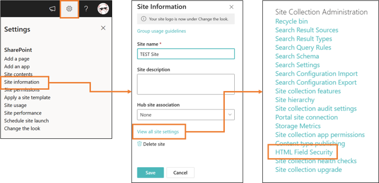

# Display QR Code

## Summary
This sample demonstrates the use of [TEC-IT's service](https://barcode.tec-it.com/QRCode) to convert column value text into a QR code and display it.

## Prerequisites

External image sources are blocked by default in the custom formatter. To allow external images, you must add the domain to **HTML Field Security**.

The following are the steps to add it.

1. Browse to the root site of your site collection
2. Select **Settings ⚙** > Select **Site information** > Select **View all site settings**
3. Select **HTML Field Security**

    

4. Input the domain name you want to allow (in the case of this sample, input "barcode.tec-it.com")
5. Select **Add**
6. Check if the added domain is listed in the list
7. Select **OK**

    

## View requirements
- This format can be applied to any column type (but is intended for text fields)

## Sample

Solution|Author(s)
--------|---------
text-qrcode.json | [Tetsuya Kawahara](https://github.com/tecchan1107)
text-qrcode-card.json | [Tetsuya Kawahara](https://github.com/tecchan1107)

## Version history

Version |Date              |Comments
--------|------------------|--------
1.0     |November 13, 2022 |Initial release

## Disclaimer
**THIS CODE IS PROVIDED *AS IS* WITHOUT WARRANTY OF ANY KIND, EITHER EXPRESS OR IMPLIED, INCLUDING ANY IMPLIED WARRANTIES OF FITNESS FOR A PARTICULAR PURPOSE, MERCHANTABILITY, OR NON-INFRINGEMENT.**

## Additional notes
- [Formatting syntax reference - img src security](https://learn.microsoft.com/sharepoint/dev/declarative-customization/formatting-syntax-reference#img-src-security)
- [Allow or restrict the ability to embed content on SharePoint pages](https://support.microsoft.com/office/allow-or-restrict-the-ability-to-embed-content-on-sharepoint-pages-e7baf83f-09d0-4bd1-9058-4aa483ee137b)

