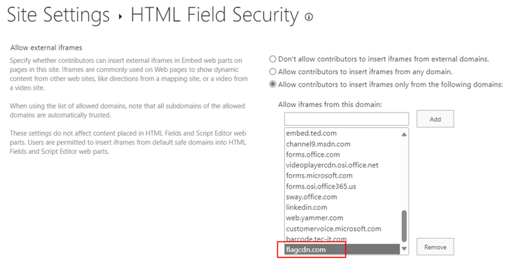

# Text StartsWith Calling Codes

## Summary
This sample demonstrates using the `indexOf` function (O365 only) to test if text starts with a given value. Using the international calling code at the start of a phone number, the correct country's flag is shown next to the phone number. The same nested conditionals are also used for the tooltip.

The `indexOf` function returns the index where a given value is found within a string (indexes start at 0). If the value is not found in the text, the result is -1.

To evaluate if text "startsWith" a given value, we want to know if the index of the value within the string is 0 (at the beginning). So we can use the function like this:

`"=if(indexOf(@currentField,'A')==0, 'Yes', 'No')"`

Some example values and the result using the function above:
`@currentField`|result
---|---
A dog | Yes
a dog | No
Pet A dog | No

Notice that the `indexOf` function is **case-sensitive**. You can do a case-insensitive check by adding the `toLowerCase` function like this:

`=if(indexOf(toLowerCase(@currentField),'a')==0, 'Yes', 'No')`

## Prerequisites

[External image sources are blocked](https://learn.microsoft.com/sharepoint/dev/declarative-customization/formatting-syntax-reference#img-src-security) by default in the custom formatter. To allow external images, you must [add the domain to HTML Field Security](https://support.microsoft.com/office/allow-or-restrict-the-ability-to-embed-content-on-sharepoint-pages-e7baf83f-09d0-4bd1-9058-4aa483ee137b). The domain that needs to be added in this sample is `flagcdn.com`.

## View requirements
- This format can be applied to a Text or Choice column
- This format uses operators only available in SharePoint Online and cannot be used in SharePoint 2019

## Sample

Solution|Author(s)
--------|---------
text-startswith-callingcodes.json | [Chris Kent](https://github.com/thechriskent) ([@thechriskent](https://twitter.com/thechriskent))

## Version history

Version|Date|Comments
-------|----|--------
1.0|February 5, 2019|Initial release
1.1|September 29, 2023|Added note about HTML Field Security and [changed domain from flags.fmcdn.net to flagcdn.com](https://flags.fmcdn.net/)

## Disclaimer
**THIS CODE IS PROVIDED *AS IS* WITHOUT WARRANTY OF ANY KIND, EITHER EXPRESS OR IMPLIED, INCLUDING ANY IMPLIED WARRANTIES OF FITNESS FOR A PARTICULAR PURPOSE, MERCHANTABILITY, OR NON-INFRINGEMENT.**

---

## Additional notes
- [Use column formatting to customize SharePoint](https://docs.microsoft.com/en-us/sharepoint/dev/declarative-customization/column-formatting)

The `indexOf` function is not available in SharePoint 2019

