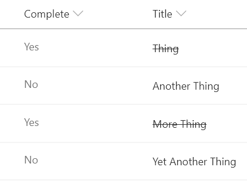

# Strikethrough on Completion

## Summary
Classic task lists add a strikethrough style to the task name when the task is marked as completed. This sample shows how to achieve this in a modern list view.

> If this is NOT the title field, then the `ms-fontColor-neutralPrimary` class can be removed to ensure styles match.

## View requirements
- This format can be applied to any column type (but is intended for text fields)
- This format expects a Yes/No field with an internal name of `Complete`

## Sample

Solution|Author(s)
--------|---------
text-strikethrough.json | [Chris Kent](https://twitter.com/thechriskent)

## Version history

Version|Date|Comments
-------|----|--------
1.0|August 18, 2018|Initial release

## Disclaimer
**THIS CODE IS PROVIDED *AS IS* WITHOUT WARRANTY OF ANY KIND, EITHER EXPRESS OR IMPLIED, INCLUDING ANY IMPLIED WARRANTIES OF FITNESS FOR A PARTICULAR PURPOSE, MERCHANTABILITY, OR NON-INFRINGEMENT.**

---

## Additional notes

> An additional version using Abstract Tree Syntax (AST) is also provided for environments where the Excel-style expressions are not supported.

