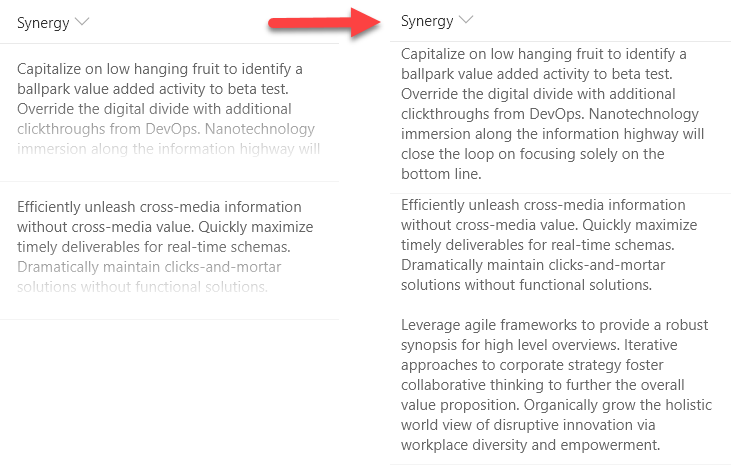

# Formatting column with long text to multiple-line with word wrap.

## Summary
With modern document libraries and lists, lengthy multi-line fields no longer show text in full (a fade is provided). This isn't always desired, so this sample demonstrates rending long text to mutilple lines with word wrap, similar to classic mode.

## View requirements
- This format can be applied to any column type (but is intended for multi-line text fields)

## Sample

Solution|Author(s)
--------|---------
text-wrap-format.json | Aaron Miao

## Version history

Version|Date|Comments
-------|----|--------
1.0|December 13, 2017|Initial release
1.1|August 20, 2018|Schema update
1.2|January 16, 2018|Added padding

## Disclaimer
**THIS CODE IS PROVIDED *AS IS* WITHOUT WARRANTY OF ANY KIND, EITHER EXPRESS OR IMPLIED, INCLUDING ANY IMPLIED WARRANTIES OF FITNESS FOR A PARTICULAR PURPOSE, MERCHANTABILITY, OR NON-INFRINGEMENT.**

---

## Additional notes
Multi-line text fields can no longer have formatting applied using the column menu within views. However, by going to the advanced settings for a column through list settings, column formats can still be applied.

Rich text fields return their values with HTML. List Formatting automatically escapes values meaning that these types of fields will include HTML in their text values and that HTML will not be used as part of the page. It is not recommended to use rich text fields with List Formatting.

