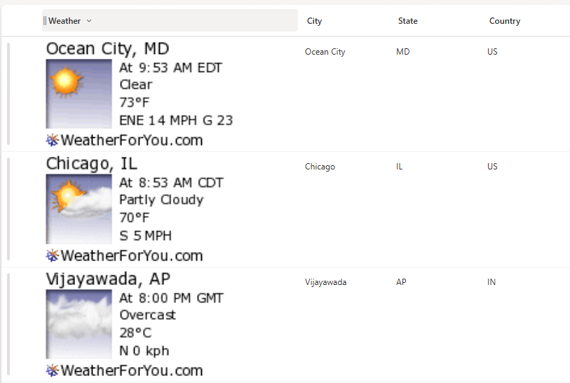

# Weather Column Formatter

This sample uses **SharePoint Column Formatting** to dynamically display **live weather images** for each list item based on city, state, and country columns.  
Each row shows the weather snapshot for the specified location, making it easy to track current conditions for multiple cities directly in a SharePoint list.



## Column Requirements

Create a list with the following columns:

| Internal Name   | Type                  |
|-----------------|----------------------|
| **City**        | Single line of text  |
| **State**       | Single line of text  |
| **Country**     | Single line of text  |
| **Weather**     | Single line of text / Column for JSON formatting |

*Note: Additional columns can be added as needed for your specific use case.*

## Sample Data

| City        | State | Country |
|------------|-------|---------|
| Vijayawada | AP    | IN      |
| Chicago    | IL    | US      |
| Ocean City | MD    | US      |
| Bengaluru  | KA    | IN      |

## How it Works

- The formatter displays a **weather image** for each row based on the City, State, and Country columns.  
- Weather images are dynamically generated using the [WeatherForYou.net](https://www.weatherforyou.net/) image service.  
- The layout uses a vertical card design with the image on top and the city/state label below.  
- Images are displayed at 120px width and automatically scale to maintain aspect ratio.  

## Security Configuration

**CRITICAL**: Before the weather images will display, you must configure SharePoint security settings:

1. Navigate to **SharePoint Admin Center**  
2. Go to **Settings** > **Advanced Settings**  
3. Find the **"HTML Field Security"** section  
4. Add `www.weatherforyou.net` to the **allowed domains** list  
5. Save the configuration  

**Without this security configuration, images will not display due to SharePoint’s content security policies.**

## Sample

Solution | Author
-------- | -------
weather-column.json | [Sai Bandaru](https://github.com/saiiiiiii) ([LinkedIn](https://www.linkedin.com/in/sai-bandaru-97a946153/))

## Version history

Version | Date | Comments
------- | ---- | --------
1.0     | September 1, 2025 | Initial release

## Disclaimer

**THIS CODE IS PROVIDED *AS IS* WITHOUT WARRANTY OF ANY KIND, EITHER EXPRESS OR IMPLIED, INCLUDING ANY IMPLIED WARRANTIES OF FITNESS FOR A PARTICULAR PURPOSE, MERCHANTABILITY, OR NON-INFRINGEMENT.**

---

## Additional Notes

### Customization Options

**Change Image Size:**  
Adjust the width/height in the JSON column formatting:

```json
"style": {
  "width": "300px",
  "height": "auto"
}
```
## Use Cases

- Regional Monitoring: Track current weather for multiple locations.

## Limitations
- Requires internet connectivity to fetch live weather images.
- External dependency on WeatherForYou.net image service.
- Make sure City, State, and Country are accurate for proper image display.
- Performance may vary with large lists due to multiple API calls

## License
This formatting solution is provided as-is for educational and professional use. The WeatherForYou.net API has its own terms of service.