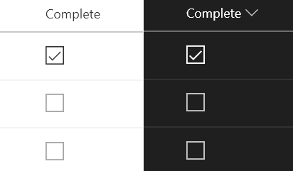

# Yes/No Checkbox

## Summary
This sample uses [Office UI Fabric](https://developer.microsoft.com/en-us/fabric) icons and theme classes to provide a better visualization for Yes/No fields while respecting theme colors.

The icons and theme colors are conditionally applied based on the field's value. By using the `ms-fontColor` classes, the icon works well in both light and dark themes (as well as custom themes). In addition, regardless of value, the `ms-fontSize-l` class is applied to make the icon large enough to stand on its own.

|Value|Class|Icon|
|---|---|---|
|Yes|ms-fontColor-neutralPrimary|CheckboxComposite|
|No|ms-fontColor-neutralTertiary|Checkbox|

## View requirements
- This format can be applied to a Yes/No column

## Sample

Solution|Author(s)
--------|---------
yesno-checkbox.json | [Chris Kent](https://twitter.com/thechriskent)

## Version history

Version|Date|Comments
-------|----|--------
1.0|August 18, 2018|Initial release

## Disclaimer
**THIS CODE IS PROVIDED *AS IS* WITHOUT WARRANTY OF ANY KIND, EITHER EXPRESS OR IMPLIED, INCLUDING ANY IMPLIED WARRANTIES OF FITNESS FOR A PARTICULAR PURPOSE, MERCHANTABILITY, OR NON-INFRINGEMENT.**

---

## Additional notes

> An additional version using Abstract Tree Syntax (AST) is also provided for environments where the Excel-style expressions are not supported.

