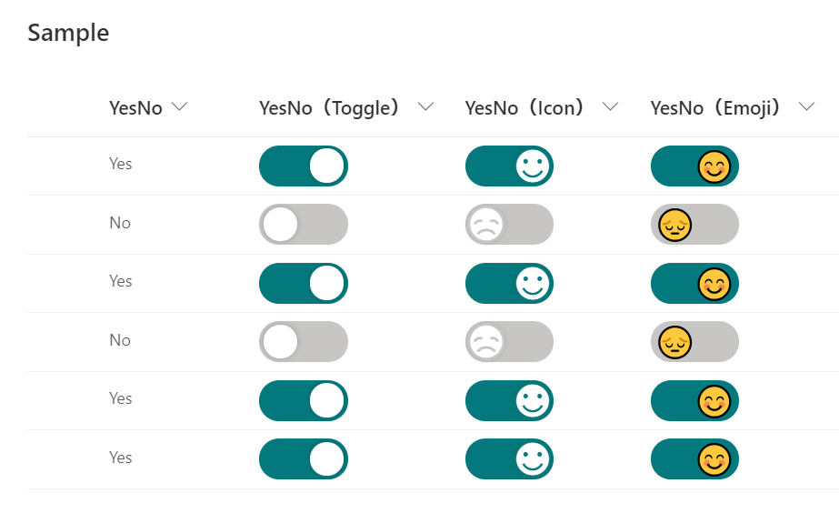

# Yes/No Column Toggle

## Summary
This sample demonstrates changing the value of the Yes/No column to a toggle.

## View requirements
This format can be applied to a Yes/No column.

## Sample

Solution                 |Author(s)
-------------------------|---------------------------
yesno-toggle-format.json |[Tetsuya Kawahara](https://twitter.com/techan_k)

## Version history

Version |Date           |Comments
--------|---------------|--------
1.0     |April 17, 2021 |Initial release

## Disclaimer
**THIS CODE IS PROVIDED *AS IS* WITHOUT WARRANTY OF ANY KIND, EITHER EXPRESS OR IMPLIED, INCLUDING ANY IMPLIED WARRANTIES OF FITNESS FOR A PARTICULAR PURPOSE, MERCHANTABILITY, OR NON-INFRINGEMENT.**

