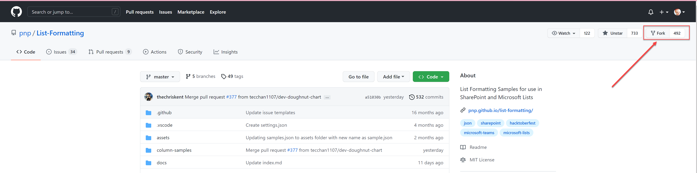
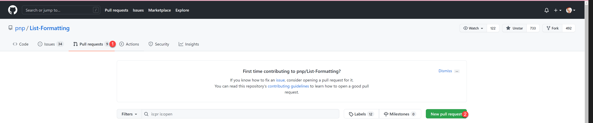
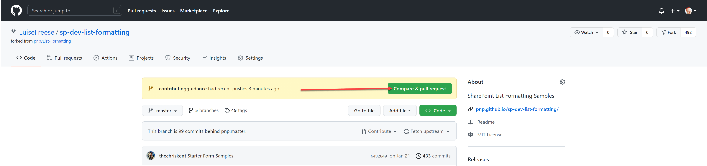

# Making Changes

The samples and related files are all stored in a repository (including this file!) within GitHub as part of the larger [PnP organization](https://github.com/pnp). This means for anything other than minor fixes, you'll be using GitHub and related tools.

Fully explaining how to use GitHub is beyond the scope of this repo, but here are the steps needed to get you working directly with the List Formatting samples repo (as a contributor).

You will need a GitHub account and all instructions below assume you are signed-in.

## Small Changes

If you want to fix a minor issue like a typo:

- Navigate directly to the file in GitHub
- Select **edit** (pencil icon in upper right). You can also press `E`
  - GitHub will automatically create a fork for you
- Make changes directly in the browser
- Add notes about what you changed in the Propose changes section and click **Propose changes**
- If prompted, click **Create pull request** to begin that process. (see [pull requests](#pull-requests) for details)

## Bigger Changes

If you would like to submit a new sample or have larger than single file changes (that make sense to be grouped together) you'll likely find it easier to develop locally. You could do it all in the browser using the above method (only doing a pull request at the end while putting all changes in the same branch of your fork), but it is considerably easier to clone things locally.

### Prerequisites

- You will need **Git** installed.
    - There are many options for installing Git and lots of tools that can simplify things. [GitHub Desktop](https://desktop.github.com/) is a free tool available on Windows and macOS created by GitHub that not only installs Git, it provides a friendly visual interface that can make things much easier. These instructions will assume the use of GitHub Desktop.
- Text Editor
    - List Formatting samples are all text based so you can literally use notepad if you'd like. However, we recommend using [VS Code](https://code.visualstudio.com/). It's free and will provide intellisense (suggestions) and code formatting that will make things much easier.

### Fork the Repository

Forking a repository means creating a copy for you to edit. You can do whatever you like in your copy of the repo without it affecting anyone else.

- Navigate to the [repository](https://github.com/pnp/list-formatting)
- Select **Fork** in the upper right

The URL of your fork is now `https://github.com/<YOURGITHUBACCOUNT>/sp-dev-list-formatting/`

### Clone your Fork

What a weird sentence! GitHub has all sorts of fun words. In this case, cloning means making a local, synchronizable copy of everything in the repository (or more accurately your copy of the repository called your fork).

- Using the green Code button select **Open with GitHub Desktop**. If prompted, tell the browser to allow the application to open.
- Follow the prompts in GitHub Desktop to choose a location on your machine to store the files (do not place it in a OneDrive location).

### Branch Out

Do your work on a dedicated branch. This makes it easier to create pull requests that pertain to a specific sample.

### Commit and Push

Be sure to commit your changes with descriptive messages. You can then push your commits to your fork in GitHub.

### Pull Requests

You will now want to (kindly) ask the repository maintainer to pull in your changes. You do that by doing a pull request:

- Open [pnp/sp-dev-list-formatting](https://github.com/pnp/sp-dev-list-formatting) (this repository)
- Select **Pull requests**
- Select **New pull request**

- Select **compare across forks**
- Select your fork from the **head repository**

- Select **Compare & pull request**

- Fill out the form (please read carefully, this way we don't need to go back and forth too often)
  - give your PR a descriptive title
  - fill out the markdown table in the body of the PR
  - describe what's in the PR
- You can always switch to **Preview** to see how it looks like
- Select **Create pull request**
- If needed, you can commit more files and changes

### Working Together

A maintainer will review your pull request, this repository is maintained by volunteers in their free time, please be kind. Everyone is doing their best to keep things moving forward.

## Getting Help

We are here and happy to support you and provide you with resources, guidance and an entire community to help you contributing. Our friends at [Sharing is Caring](https://aka.ms/sharing-is-caring) run sessions on how you get started and will help you along the way. If you have any questions, please reach out to any [Microsoft 365 PnP member](https://aka.ms/m365pnp), they will point you into the right direction.

_Sharing is Caring!_

