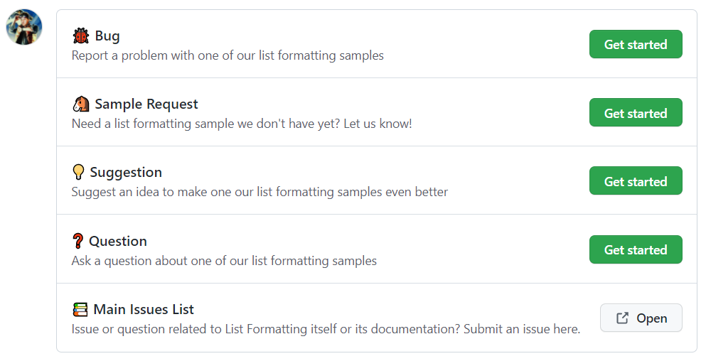

# Submitting an Issue or Suggestion

See something that isn't quite right? Got an idea for a new sample or anything else? Good news! There's an issues list dedicated to this repository!

## Support

The samples included in this repository are made freely available to you by the Microsoft 365 Platform Community (PnP). As with all things PnP, PnP is not a product and neither are these samples and therefore they are _not_ supported by official support channels.

We encourage you to use these samples to learn and build new formats for your environment. But please be aware that there is no Service Level Agreement (SLA) that applies here.

You can find more details about what is and isn't supported when it comes to PnP by referring to our official [Supportability Statement](https://pnp.github.io/#support)

### Community Support

The Microsoft 365 Platform Community and associated assets (including these samples) are supported in similar ways as other open source projects done by Microsoft with support **_from_ the community _by_ the community**.

This means you can't submit an official support ticket about one of these samples not working. But it does not mean that there's no where to go for help. Issues can be submitted in this repository and then members of the community (perhaps even you!) will then do their best to sort through and assist as the issues come in.

## What are Issues?

When you click on Issues and click the **New issue** button you'll be taken to our [issue choice](https://github.com/pnp/List-Formatting/issues/new/choose) page:

Regardless of which type you choose, an issue will be created in the issues list and will be dealt with in the same priority as any other issue. The difference is in the issue template you're presented with.

### Bugs

Choose **Bug** when there's something wrong with a _sample_.

!!! Important "Samples Only"
    Problems with List Formatting, Lists, or anything else not a sample should be submitted as a support ticket with Microsoft or on the [main issues list](https://aka.ms/sp-dev-issues).

Keep in mind, we accept [pull requests](./changes.md#pull-requests) which means if you know what's causing the bug, we'd be happy to have you fix it! But that is not required at all and we're still grateful just to be made aware of an issue.

### Sample Requests

Have a need for a sample that isn't here yet? Make a request! Keep in mind these are only requests and there is no guarantee that anyone will make it. However, there are lots of awesome community members that love helping out and are looking for ways to do that.

Please be as detailed as you can be when talking about what you need. Include any color/theme requirements, column restrictions, overall goals, etc. The more details you provide the more likely it is that someone will be able to help.

Break up complicated issues into multiple requests. Overly daunting requests aren't likely to get a lot of attention.

Be respectful and kind. Nobody works for you. If someone is assisting, it is out of the goodness of their heart. Keep in mind, also, that the final result may not fit your needs exactly but may provide some demonstration of the things you need while being put together for a larger audience.

Looking to make a [sample](./sample.md) of your own? These requests are an excellent way to get ideas!

### Suggestions

Think a sample (or anything else in this repository) could be better? Let us know through a suggestion!

Suggestions could be minor tweaks or they could be major changes (or even alternate versions of a sample). These are typically things that apply to an existing sample. If you've got an idea for a whole new sample, then please use the Sample Request option.

Keep in mind, we accept [pull requests](./changes.md#pull-requests) which means if you know how to implement your suggestion, we'd be happy to have you do it! But that is not required at all and we're still grateful just to hear your suggestion.

If you have an idea for improving a sample and are willing to do it, for anything than a minor tweak it's still a good idea to submit it as a suggestion. This allows us to discuss if it makes sense before you spend the time on it. This isn't required either (just a good idea).

### Questions

Not sure if something's a bug but it doesn't seem right or perhaps it isn't obvious how to get a sample into your environment or maybe you see something in a sample that doesn't make sense to you and you'd like an explanation. Any of those things would make sense as a question!

Questions should be about one of the included _samples_ - not list formatting in general.

## Submitting an Issue

You can submit an issue by clicking on the [Issues tab](https://github.com/pnp/List-Formatting/issues) for the repository and choosing New issue.

This will require you to have a [GitHub account](https://github.com). These are free and only require an email address.

If you are uncomfortable with GitHub, there are several other tech communities out there including Stack Exchange, Reddit, Facebook, and more where many of our members are also answering questions.

