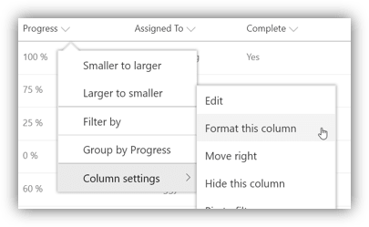

# Applying Column Formats

Column Formats are applied directly to list fields or site columns and stored with them.

## Format this column menu

Most supported column types provide a **"Format this column"** menu option in the column menu within the modern list view:

This will open the **Format column panel** where you can **paste** your format and click **Save** to apply:

Some column types provide **Design Mode** wizards. These can be helpful, but to apply a format directly click the **Advanced mode** link and you can now **paste** your format and click **Save** to apply:

## Field Settings

You can also apply formats directly in the field settings screen for both list fields and site columns. Just navigate to the field settings screen (List Settings > Field) and near the bottom is a spot where you can **paste** your format and save it with your field or site column:

