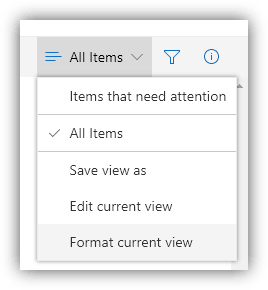

# Applying View Formats

View Formats are applied to individual views for a given list/library and stored with them.

## Format current view menu

Clicking on the view dropdown within your modern list view will provide a **"Format current view"** menu option:

This will open the **Format view panel** where you can **paste** your format and clik **Save** to apply:

!!! tip
    You can apply multiple view formats to a list by using different views. This can make for powerful displays of the same data.

