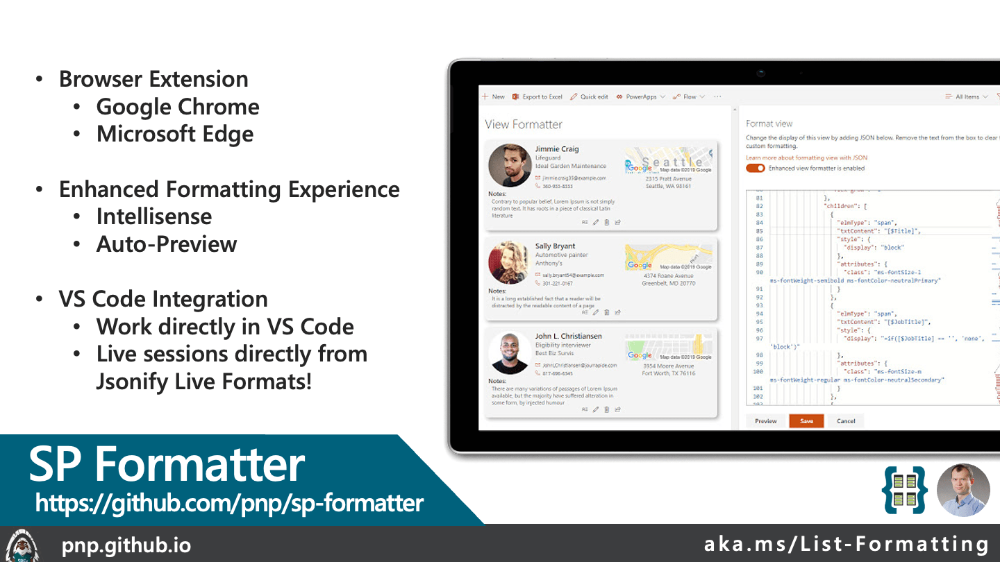

# Formatter Helper Tools

These tools should help you in build the basic JSON skeleton, if you are trying to create custom-formatters by hand. 

## [SP Formatter](https://github.com/pnp/sp-formatter)

Customize your SharePoint Column, View or Form Layout Formatting JSON using a full-featured editor instead of the default one.

- Live Preview as you type (no need to click "Preview" button)
- Intellisense (suggestions) based on Column or View formatting schema, CSS styles, replaceable tokens (`@currentField`, list fields with `$` based on the context)
- JSON validation with error messages in the editor
- Help tooltips for JSON properties
- Color highlights
- Line numbers, brace matching, collapsible regions
- Hotkeys: search, replace, format document, go to line and others available for monaco-editor
- Easily switch between default and enhanced editor
- VSCode integration
- Full screen mode

SP Formatter is a free browser extension ([Chrome](https://chromewebstore.google.com/detail/sp-formatter/fmeihfaddhdkoogipahfcjlicglflkhg) & [Microsoft Edge](https://microsoftedge.microsoft.com/addons/detail/sp-formatter/eenbldkdgbfcfachaccldfgiajgjmjhi?hl=en-US)). There is also a free companion extension for [VS Code](https://marketplace.visualstudio.com/items?itemName=s-kainet.sp-formatter).

!!! Note "SharePoint 2019 Support"
    SP Formatter provides support for SharePoint 2019! However, it is a [separate extension](https://github.com/pnp/sp-formatter/blob/master/sp2019/README.md).

## [Jsonify](https://marketplace.visualstudio.com/items?itemName=thechriskent.jsonify)

jsonify lets you instantly convert HTML and SVG files to Microsoft SharePoint List Formats. Right click on an `SVG` or `HTML` file and choose `Convert to SP List Format` and a new editor will open with a column format that draws your image. As you make changes to your original file, the format will continue to update. Wowee!

jsonify also extends the definition of JSON to inject support for HorseScript syntax highlighting (list formatting expressions). This means your expressions get true syntax highlighting even when written as JSON properties - and not just highlighting, Jsonify adds completions, signature helpers, and hover cards all for inline expressions. Additional Wowee!

- Syntax highlighting of expressions
- Hover provider (documentation and guidance)
- Completion provider (intellisense)
- Signature Helper (function guidance and parameter mapping)
- Maps all supported attributes and styles
- Automatically converts common SVG shape elements (rect, circle, ellipse, line, polyline, and polygon) to paths
- Collapses SVG element groups and other non-visual containers (ie g)
- Generated formats are kept in sync with your original file (until you save or close them)
- Classes defined in style elements are applied and removed
- Classes only used in selectors or applied directly to elements are maintained
- SPFx style theme token support (instead of color: white; use color: "[theme:white]";)
- Use formatting expressions as CSS properties and other attribute values
- Warrior Horse Theme (Dark)

jsonify is a free extension for [VS Code](https://marketplace.visualstudio.com/items?itemName=theChrisKent.jsonify). Works great with SP Formatter!

## [vscode-pets](https://marketplace.visualstudio.com/items?itemName=tonybaloney.vscode-pets)

This has nothing to do with list formatting but it sure is fun!

## [Deployment with VS Code & PowerShell/M365 CLI](https://github.com/pnp/List-Formatting/tree/master/tools/general-dynamic-deployment-with-vscode)

A collection of tools that allow you to dynamically deploy SharePoint List Formatting directly form within VS Code.

## [Generate from HTML](./html-formatter-generator/index.html)

Most developers are tuned to seeing and writing HTML quicker than JSON. This tool can help building a formatter from a given HTML. You can even put in some css to get inline styles populated.

This tool doesnot recognize `expressions` , but you can write `expression strings` in place of any attribute value and it will be put as-is on the generated JSON.

- **[HTML To Formatter](./html-formatter-generator/index.html)**

!!! Note "HTML To Formatter Deprecated"
    This tool is no longer supported and is provided only for legacy projects. Additional updates to this tool will not be made. You can find similar functionality in Jsonify listed above.

