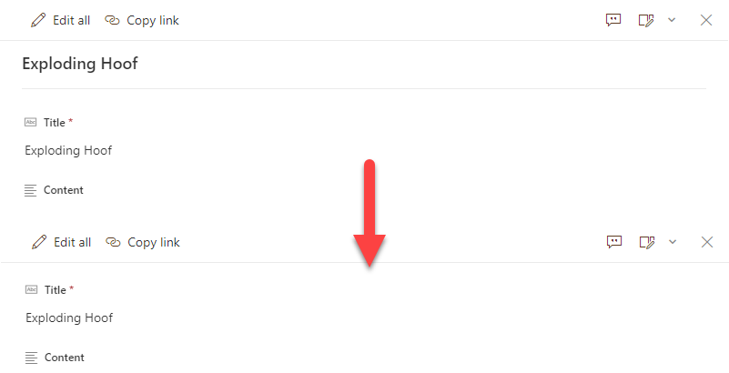

# Blank Header

## Summary
By default, uncustomized list forms display the `Title` field at the top. This is generally fine, but sometimes you may not want this (especially since the default is to repeat it as the first column). This very basic format removes the default `Title` display giving you a cleaner form.

## Form requirements
None

## Sample

Solution|Author(s)
--------|---------
blank-header.json | [Chris Kent](https://github.com/thechriskent)

## Version history

Version|Date|Comments
-------|----|--------
1.0|January 21, 2021|Initial release

## Additional notes
None

## Disclaimer

**THIS CODE IS PROVIDED *AS IS* WITHOUT WARRANTY OF ANY KIND, EITHER EXPRESS OR IMPLIED, INCLUDING ANY IMPLIED WARRANTIES OF FITNESS FOR A PARTICULAR PURPOSE, MERCHANTABILITY, OR NON-INFRINGEMENT.**

> Update telemetry url below to replace "readme-template" with the internal name of your sample (same as the containing folder)
