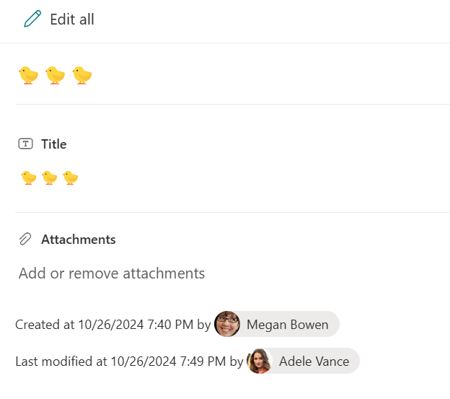

# Display Created and Modified Information in the Footer

## Summary

This sample demonstrates displaying the values of "Created" (internal name: `Created`), "Created By" (internal name: `Author`), "Modified" (internal name: `Modified`), and "Modified By" (internal name: `Editor`) in the footer of the form.

## Form requirements

None

## Sample

Solution|Author(s)
--------|---------
created-modified-footer.json | [Tetsuya Kawahara](https://github.com/tecchan1107)

## Version history

Version |Date             |Comments
--------|-----------------|--------
1.0     |October 27, 2024 |Initial release

## Disclaimer
**THIS CODE IS PROVIDED *AS IS* WITHOUT WARRANTY OF ANY KIND, EITHER EXPRESS OR IMPLIED, INCLUDING ANY IMPLIED WARRANTIES OF FITNESS FOR A PARTICULAR PURPOSE, MERCHANTABILITY, OR NON-INFRINGEMENT.**

