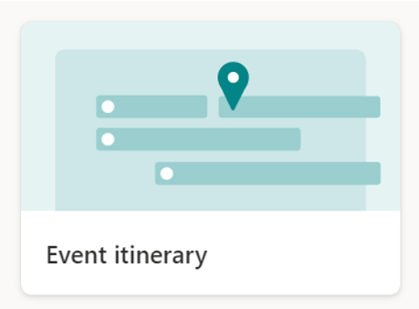

# Event Itinerary Header

## Summary
This sample shows a customized header for the "Event itinerary" list in the list template.

## View requirements

The following fields are all included in the "Event itinerary" template.

|Type                   |Internal Name    |Required|
|-----------------------|-----------------|:------:|
|Single line of text    |Title            |Yes     |
|Multiple lines of text |Description      |No      |
|Single line of text    |SessionCode      |No      |
|Choice                 |SessionType      |No      |
|Person or Group        |Speakers         |No      |
|Date and Time          |StartDateAndTime |No      |
|Date and Time          |EndDateAndTime   |No      |
|Calculated             |Duration         |No      |
|Number                 |Capacity         |No      |
|Choice                 |Location         |No      |
|Multiple lines of text |Notes            |No      |

## Sample

Solution                    |Author(s)
----------------------------|---------------------------
event-itinerary-header.json |[Tetsuya Kawahara](https://twitter.com/techan_k)

## Version history

Version |Date             |Comments
--------|-----------------|--------
1.0     |January 31, 2021 |Initial release

## Disclaimer
**THIS CODE IS PROVIDED *AS IS* WITHOUT WARRANTY OF ANY KIND, EITHER EXPRESS OR IMPLIED, INCLUDING ANY IMPLIED WARRANTIES OF FITNESS FOR A PARTICULAR PURPOSE, MERCHANTABILITY, OR NON-INFRINGEMENT.**

