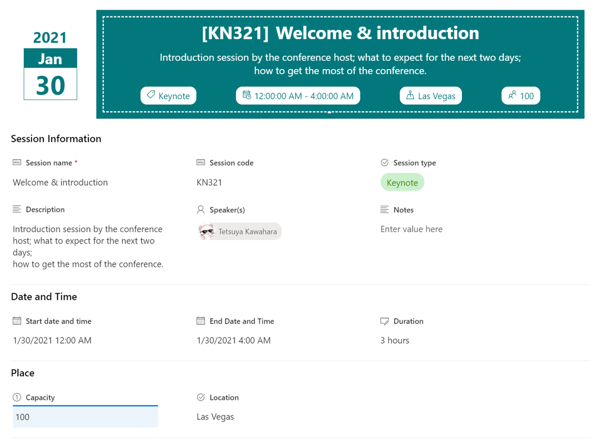

# Event Itinerary Header

## Summary
This sample shows a customized header for the item form used in the "Event itinerary" list template.

This format is intended for the Header Format of the form body in the Configure Layout panel. The body layout shown in the screenshot can be obtained by configuring sections within the Body panel (not included in this format).

## Form requirements

The following fields are all included in the "Event itinerary" template. You can find this template in the new List dialog:

|Type                   |Internal Name    |Required|
|-----------------------|-----------------|:------:|
|Single line of text    |Title            |Yes     |
|Multiple lines of text |Description      |No      |
|Single line of text    |SessionCode      |No      |
|Choice                 |SessionType      |No      |
|Person or Group        |Speakers         |No      |
|Date and Time          |StartDateAndTime |No      |
|Date and Time          |EndDateAndTime   |No      |
|Calculated             |Duration         |No      |
|Number                 |Capacity         |No      |
|Choice                 |Location         |No      |
|Multiple lines of text |Notes            |No      |

## Sample

Solution                    |Author(s)
----------------------------|---------------------------
event-itinerary-header.json |[Tetsuya Kawahara](https://twitter.com/techan_k)

## Version history

Version |Date             |Comments
--------|-----------------|--------
1.0     |January 31, 2021 |Initial release

## Disclaimer
**THIS CODE IS PROVIDED *AS IS* WITHOUT WARRANTY OF ANY KIND, EITHER EXPRESS OR IMPLIED, INCLUDING ANY IMPLIED WARRANTIES OF FITNESS FOR A PARTICULAR PURPOSE, MERCHANTABILITY, OR NON-INFRINGEMENT.**

