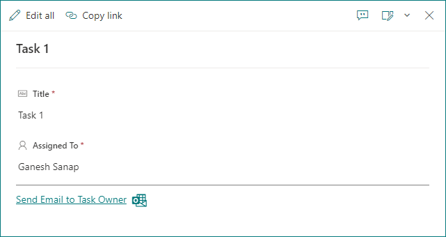

# Send Email to Task owner

## Summary

This sample demonstrates displaying Email link to send an email to owner of the task in SharePoint list.

## Form requirements

|Type                   |Internal Name|Required|
|-----------------------|-------------|:------:|
|Single line of text    |Title        |Yes     |
|Person or Group        |AssignedTo   |Yes     |

## Sample

Solution|Author(s)
--------|---------
send-email-task-owner-footer.json | [Ganesh Sanap](https://ganeshsanapblogs.wordpress.com/about/) ([@ganeshsanap20](https://twitter.com/ganeshsanap20))

## Version history

Version |Date             |Comments
--------|-----------------|--------
1.0     |October 15, 2022 |Initial release

## Disclaimer

**THIS CODE IS PROVIDED *AS IS* WITHOUT WARRANTY OF ANY KIND, EITHER EXPRESS OR IMPLIED, INCLUDING ANY IMPLIED WARRANTIES OF FITNESS FOR A PARTICULAR PURPOSE, MERCHANTABILITY, OR NON-INFRINGEMENT.**

