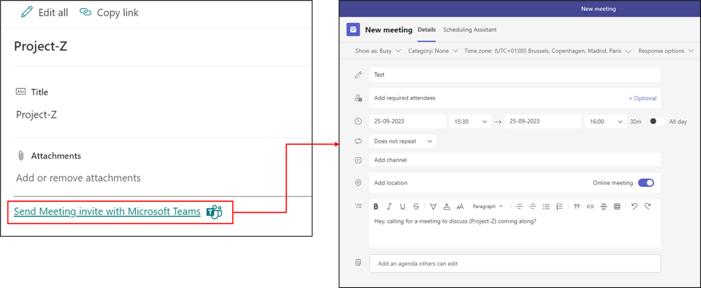

# Send Meeting Invite with Microsoft Teams

## Summary

This sample demonstrates sending a meeting invite via Microsoft Teams to attendees in SharePoint list. The JSON can be used as Footer within SharePoint List formatting.

## Form requirements

|Type                   |Internal Name|Required|
|-----------------------|-------------|:------:|
|Single line of text    |Title        |Yes     |

## Sample

Solution|Author(s)
--------|---------
send-meeting-invite-with-teams-footer.json | [Vignesh Manohar](https://github.com/VigneshManohar)

## Version history

Version |Date             |Comments
--------|-----------------|--------
1.0     |Sepetember 25, 2023 |Initial release

## Disclaimer

**THIS CODE IS PROVIDED *AS IS* WITHOUT WARRANTY OF ANY KIND, EITHER EXPRESS OR IMPLIED, INCLUDING ANY IMPLIED WARRANTIES OF FITNESS FOR A PARTICULAR PURPOSE, MERCHANTABILITY, OR NON-INFRINGEMENT.**

---

## Additional notes

- This sample uses [deep link](https://learn.microsoft.com/microsoftteams/platform/concepts/build-and-test/deep-link-workflow?tabs=teamsjs-v2#deep-link-to-open-a-meeting-scheduling-dialog
) to open a meeting scheduling dialog.

