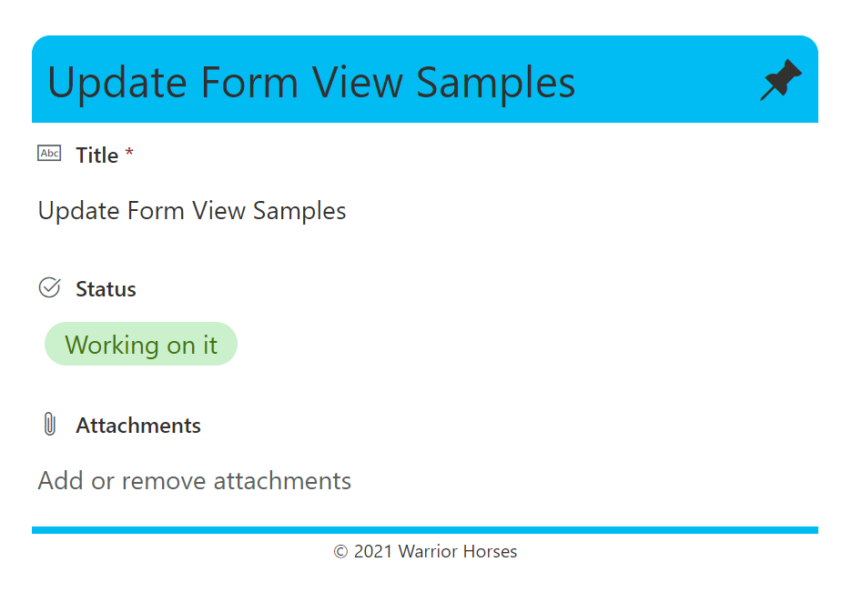
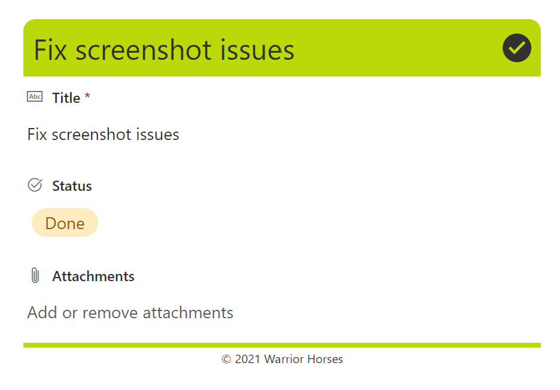
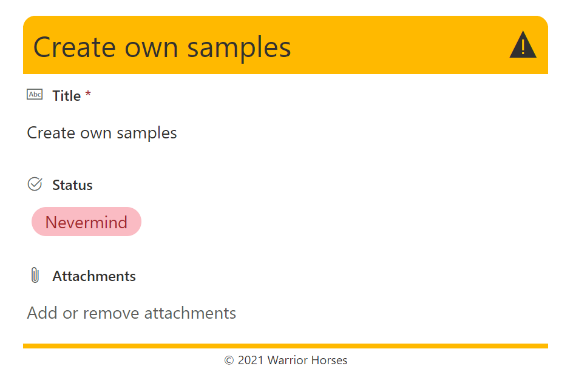
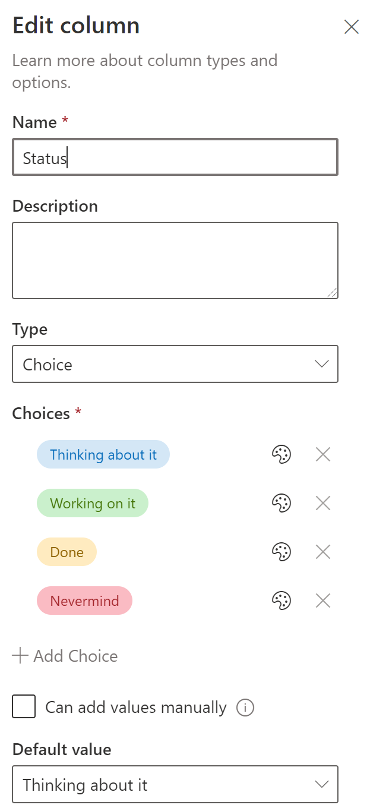

# Status Header and Footer

## Summary
This sample shows a customized header and footer for a form with a Status column with possible values 'Thinking about it', 'Working on it', 'Done', and 'Nevermind'. 

This format is intended for the Header Format and Footer Format of the form body in the Configure Layout panel. Depending on the value of the Status column, a corresponding icon and colour scheme are used.

## Form requirements

A Choice column called Status is required with possible values 'Thinking about it', 'Working on it', 'Done', and 'Nevermind'. 

|Type                   |Internal Name    |Required|
|-----------------------|-----------------|:------:|
|Single line of text    |Title            |Yes     |
|Choice                 |Status           |No      |

## Sample

Solution                    |Author(s)
----------------------------|---------------------------
status-footer.json |[Chris Kent](https://twitter.com/thechriskent)
status-header.json |[Chris Kent](https://twitter.com/thechriskent)

## Version history

Version |Date             |Comments
--------|-----------------|--------
1.0     |January 31, 2021 |Initial release
2.0     |August 20, 2021 | Added readme and screenshots

## Disclaimer
**THIS CODE IS PROVIDED *AS IS* WITHOUT WARRANTY OF ANY KIND, EITHER EXPRESS OR IMPLIED, INCLUDING ANY IMPLIED WARRANTIES OF FITNESS FOR A PARTICULAR PURPOSE, MERCHANTABILITY, OR NON-INFRINGEMENT.**

