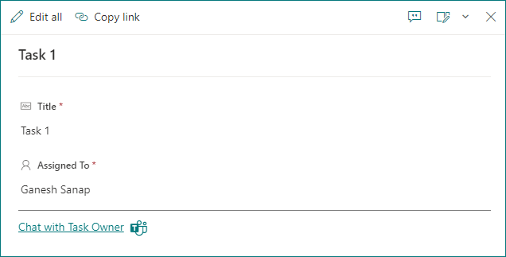

# Microsoft Teams chat with Task owner

## Summary

This sample demonstrates displaying Microsoft Teams chat link to chat with owner of the task in SharePoint list.

## Form requirements

|Type                   |Internal Name|Required|
|-----------------------|-------------|:------:|
|Single line of text    |Title        |Yes     |
|Person or Group        |AssignedTo   |Yes     |

## Sample

Solution|Author(s)
--------|---------
teams-chat-task-owner-footer.json | [Ganesh Sanap](https://github.com/ganesh-sanap) ([@ganeshsanap20](https://twitter.com/ganeshsanap20))

## Version history

Version |Date             |Comments
--------|-----------------|--------
1.0     |October 15, 2022 |Initial release

## Disclaimer

**THIS CODE IS PROVIDED *AS IS* WITHOUT WARRANTY OF ANY KIND, EITHER EXPRESS OR IMPLIED, INCLUDING ANY IMPLIED WARRANTIES OF FITNESS FOR A PARTICULAR PURPOSE, MERCHANTABILITY, OR NON-INFRINGEMENT.**

---
## Additional notes

Microsoft Teams chat link uses deep link.

- [Navigate to a chat](https://learn.microsoft.com/microsoftteams/platform/concepts/build-and-test/deep-links#navigate-to-a-chat)

