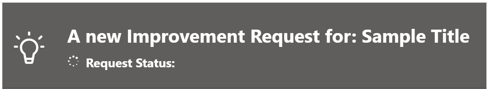
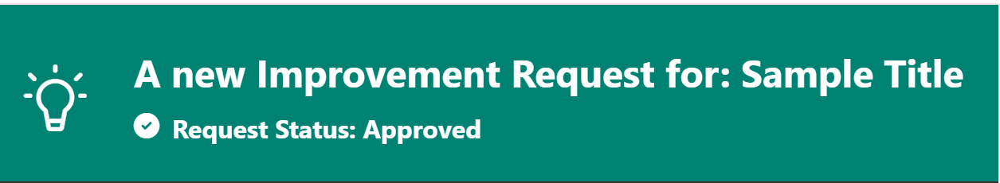

# Two Column Logo Header

## Summary

This sample displays an `Icon` and `Title` in a two column header with the Icon on the left and the `Title` on the right. An additional `Icon` and `RequestStatus` and added below the `Title`.

## Form requirements

|Type                   |Internal Name|Required|
|-----------------------|-------------|:------:|
|Single line of text    |Title        |Yes     |
|Choice |RequestStatus  |Yes      |

### RequestStatus Choices

|Value           |
|----------------|
|Approved|
|Pending|
|Rejected|
|Withdrawn|

Based on the value of `RequestStatus` value, the color of the column is changed along with the icon.

- RequestStatus: Default (not chosen)

    

- RequestStatus: Approved

    

- RequestStatus: Pending

    

- RequestStatus: Rejected

    

- RequestStatus: Withdrawn

    

## Logo

This sample logo uses the `CRMCustomerInsightsApp` from [Fluent UI Icons](https://developer.microsoft.com/en-us/fluentui#/styles/web/icons).

## Sample

Solution|Author(s)
--------|---------
two-column-logo-header.json | [Andrew Burns ](https://github.com/GeorgiaGit) ([@SharePointRox](https://x.com/SharePointRox))

## Version history

Version |Date              |Comments
--------|------------------|--------
1.0     |July 14, 2024  |Initial release

## Disclaimer
**THIS CODE IS PROVIDED *AS IS* WITHOUT WARRANTY OF ANY KIND, EITHER EXPRESS OR IMPLIED, INCLUDING ANY IMPLIED WARRANTIES OF FITNESS FOR A PARTICULAR PURPOSE, MERCHANTABILITY, OR NON-INFRINGEMENT.**

