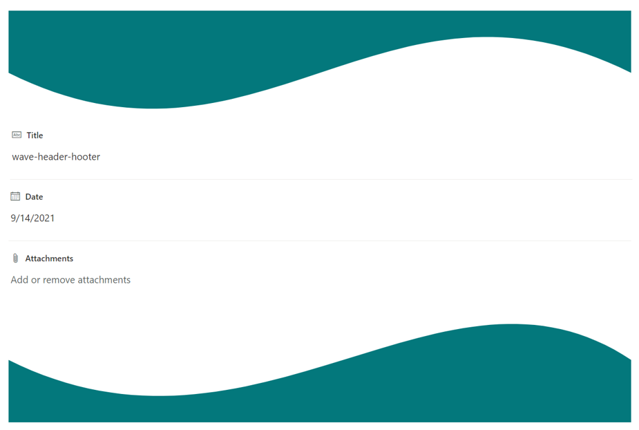

# Wave header and footer

## Summary
This sample demonstrates how to display waves in the header and footer of a form. Waves are displayed using SVG.

## Form requirements

None

## Sample

Solution|Author(s)
--------|---------
wave-header.json | [Tetsuya Kawahara](https://github.com/tecchan1107) ([@techan_k](https://twitter.com/techan_k))
wave-footer.json | [Tetsuya Kawahara](https://github.com/tecchan1107) ([@techan_k](https://twitter.com/techan_k))

## Version history

Version |Date               |Comments
--------|-------------------|--------
1.0     |September 14, 2021 |Initial release

## Disclaimer
**THIS CODE IS PROVIDED *AS IS* WITHOUT WARRANTY OF ANY KIND, EITHER EXPRESS OR IMPLIED, INCLUDING ANY IMPLIED WARRANTIES OF FITNESS FOR A PARTICULAR PURPOSE, MERCHANTABILITY, OR NON-INFRINGEMENT.**

