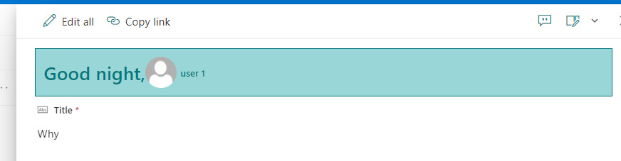
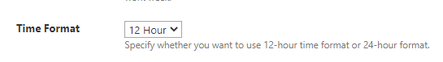
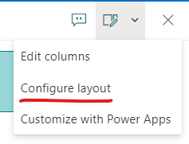

# Welcome Header

## Summary
This sample demonstrates how to display Welcome message depending on time of day, display user profile image and display user name if formated in mail address (sample: `user.1@[domain].com`).

## Form requirements

### Time format (12 Hours or 24 Hours)

Identify what regional settings are being used in site.
- Normally the default configuration can be accessed on to Top right icon > Site informations > View all site settings > Regional Settings or Time format is managed by **M365 administrator**.

### How to implement

Access to list where customization will be apply, edit item, access top right options and select **"Configure layout"** and implement json for **Header**.

This information is important to use sample, since `12 hours` uses **12:00:00 AM and 12:00:00 PM** and `24 hours` uses **0:00:00 to 24:00:00**.
- Based on this information (`12 Hours/24 Hours`) you can use sample json for testing.

## Sample

Solution|Author(s)
--------|---------
welcome-header.json | [Andre Lage](https://github.com/aaclage)
welcome-header-24hours.json | [Andre Lage](https://github.com/aaclage)

## Version history

Version |Date             |Comments
--------|-----------------|--------
1.0     |March 14, 2023 |Initial release

## Disclaimer
**THIS CODE IS PROVIDED *AS IS* WITHOUT WARRANTY OF ANY KIND, EITHER EXPRESS OR IMPLIED, INCLUDING ANY IMPLIED WARRANTIES OF FITNESS FOR A PARTICULAR PURPOSE, MERCHANTABILITY, OR NON-INFRINGEMENT.**

