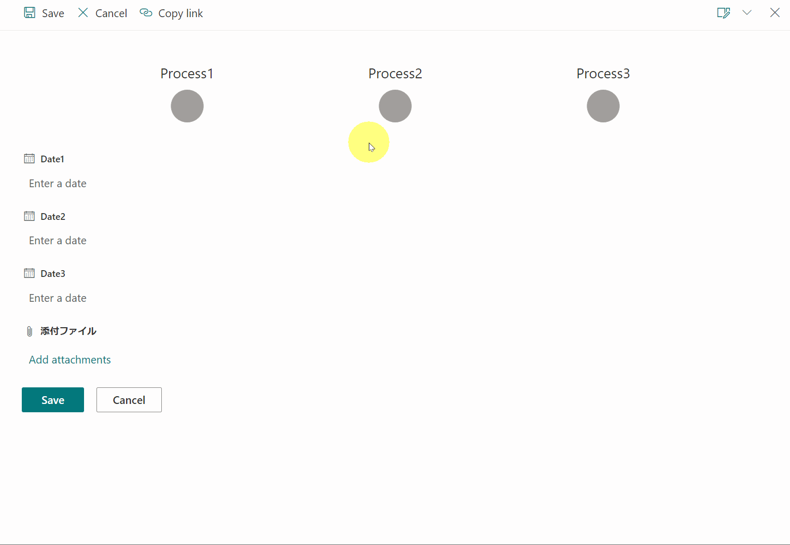

# Workflow Progress Header

## Summary
This sample shows a checkmark for each date field that has a value to help convey when milestones have been hit.

## View requirements

|Type          |Internal Name |Required|
|--------------|--------------|:------:|
|Date and Time |Date1         |No      |
|Date and Time |Date2         |No      |
|Date and Time |Date3         |No      |

## Sample

Solution                      |Author(s)
------------------------------|---------------------------
workflow-progress-header.json |[Tetsuya Kawahara](https://twitter.com/techan_k)

## Version history

Version |Date             |Comments
--------|-----------------|--------
1.0     |February 1, 2021 |Initial release

## Disclaimer
**THIS CODE IS PROVIDED *AS IS* WITHOUT WARRANTY OF ANY KIND, EITHER EXPRESS OR IMPLIED, INCLUDING ANY IMPLIED WARRANTIES OF FITNESS FOR A PARTICULAR PURPOSE, MERCHANTABILITY, OR NON-INFRINGEMENT.**

