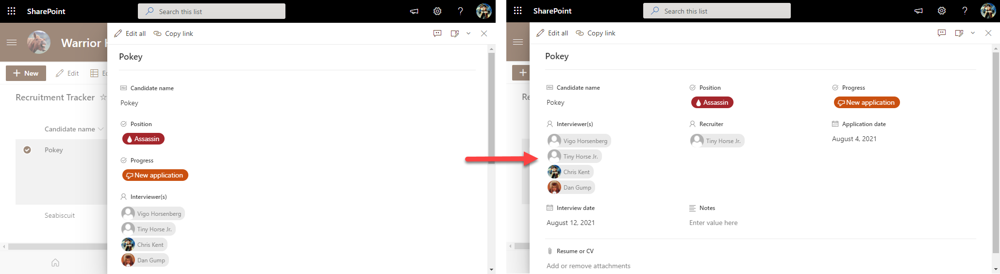

# Wrapped Form Body

## Summary
By default, uncustomized list forms display the fields in a single column. This is generally fine, but sometimes you may want to use more horizontal space and have your fields wrap. This is not technically a format but rather a body layout. No columns or sections are specified meaning that this can be applied to any form and it won't change the order of display or what columns are visible it simply adds the wrapping.

## Form requirements
None

## Sample

Solution|Author(s)
--------|---------
wrapped-body.json | [Chris Kent](https://github.com/thechriskent)

## Version history

Version|Date|Comments
-------|----|--------
1.0|January 21, 2021|Initial release

## Additional notes
None

## Disclaimer

**THIS CODE IS PROVIDED *AS IS* WITHOUT WARRANTY OF ANY KIND, EITHER EXPRESS OR IMPLIED, INCLUDING ANY IMPLIED WARRANTIES OF FITNESS FOR A PARTICULAR PURPOSE, MERCHANTABILITY, OR NON-INFRINGEMENT.**

> Update telemetry url below to replace "readme-template" with the internal name of your sample (same as the containing folder)
