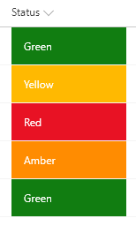
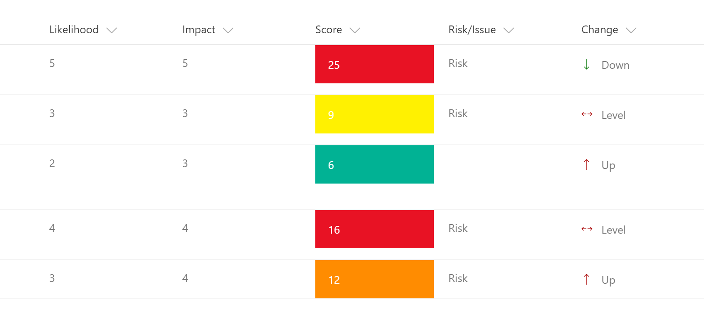

# Customise SharePoint Online Columns Using JSON - Column Formatting

### Risk Register columns formatting
Risk register where there are two columns formatted i) ‘Risk Score’ (a calculated column) is formatted based on the condition and ii) ‘Risk Status Level’ is formatted with icons / colors. You can use other icon from Office Graph.

In the risk level change status json file, `@Change` is the internal fieldname. Please replace as appropriate.

## Disclaimer
**THIS CODE IS PROVIDED *AS IS* WITHOUT WARRANTY OF ANY KIND, EITHER EXPRESS OR IMPLIED, INCLUDING ANY IMPLIED WARRANTIES OF FITNESS FOR A PARTICULAR PURPOSE, MERCHANTABILITY, OR NON-INFRINGEMENT.**

### Project Register column formatting
Project Register where ‘Current Status’ column is formatted based on the RYAG status.

<table>
<thead>
<tr>
<th>Solution</th>
<th>Author(s)</th>
</tr>
</thead>
<tbody>
<tr>
<td>risk-level-change-status.json</td>
<td>S Merchant</td>
</tr>
  <tr>
<td>risk-score.json</td>
<td>S Merchant</td>
</tr>
    <tr>
<td>ryg-status.json</td>
<td>S Merchant</td>
</tr>
  </tbody></table>
<table>
<thead>
<tr>
<th>Version</th>
<th>Date</th>
<th>Comments</th>
</tr>
</thead>
<tbody>
<tr>
<td>1.0</td>
<td>10 November 2017</td>
<td>Initial release</td>
</tr></tbody></table>

<strong>THIS CODE IS PROVIDED <em>AS IS</em> WITHOUT WARRANTY OF ANY KIND, EITHER EXPRESS OR IMPLIED, INCLUDING ANY IMPLIED WARRANTIES OF FITNESS FOR A PARTICULAR PURPOSE, MERCHANTABILITY, OR NON-INFRINGEMENT.</strong>

