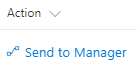

# Creating a link to launch a Flow

## Summary
This example provides a link/button to start a workflow based on the current item.
To use the example, you first have to create a workflow and use the guid of that specific workflow. The guid than has to be provided in the .json of the column formatting.

## Sample

Solution|Author(s)
--------|---------
start-flow-button.json | Yannick Borghmans

## Disclaimer
**THIS CODE IS PROVIDED *AS IS* WITHOUT WARRANTY OF ANY KIND, EITHER EXPRESS OR IMPLIED, INCLUDING ANY IMPLIED WARRANTIES OF FITNESS FOR A PARTICULAR PURPOSE, MERCHANTABILITY, OR NON-INFRINGEMENT.**

---

## Additional notes
This sample is also covered in the main documentation around the Column Formatting

- [Use column formatting to customize SharePoint](https://docs.microsoft.com/en-us/sharepoint/dev/declarative-customization/column-formatting)

