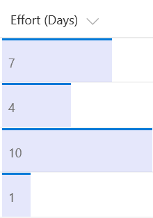

# Format a number column as a data bar

## Summary
This example applies `background-color` and `border-top` styles to create a data bar visualization of `@currentField`, which is a number field. The bars are sized differently for different values based on the way the `width` attribute is set - it's set to `100%` when the value is greater than 20, and `(@currentField * 5)%` when there value is less than 10. This achieves a width of 5% for the data bar for values of 1, 10% for values of 2, and so on. To fit this example to your number column, you can adjust the boundary condition (`20`) to match the maximum anticipated value inside the field, and the multiplier (`5`) to specify how much the bar should grow depending on the value inside the field.

## Sample

Solution|Author(s)
--------|---------
number-data-bar.json | SharePoint Team

## Version history

Version|Date|Comments
-------|----|--------
1.0|November 2, 2017|Initial release

## Disclaimer
**THIS CODE IS PROVIDED *AS IS* WITHOUT WARRANTY OF ANY KIND, EITHER EXPRESS OR IMPLIED, INCLUDING ANY IMPLIED WARRANTIES OF FITNESS FOR A PARTICULAR PURPOSE, MERCHANTABILITY, OR NON-INFRINGEMENT.**

---

## Additional notes
This sample is also covered in the main documentation around the Column Formatting

- [Use column formatting to customize SharePoint](https://docs.microsoft.com/en-us/sharepoint/dev/declarative-customization/column-formatting)

