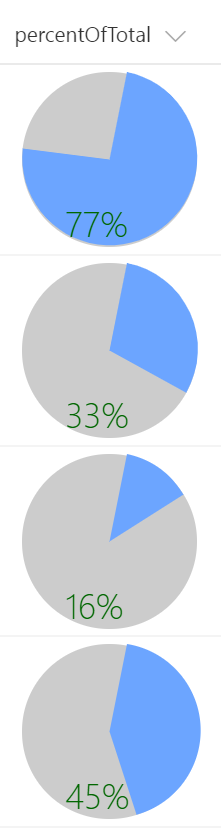

# Formatting percentage number (%) to pie chart.

## Summary
This example renders whole pie in gray with radius 50 and the number% (column value) as a slice of the pie in blue using `<svg>` with `<path>` tags. The number% displayed at the bottom of the pie in green.

## Sample

Solution|Author(s)
--------|---------
number-pct-piechart.json | Aaron Miao

## Version history

Version|Date|Comments
-------|----|--------
1.0|Dec 13, 2017|Initial release

## Disclaimer
**THIS CODE IS PROVIDED *AS IS* WITHOUT WARRANTY OF ANY KIND, EITHER EXPRESS OR IMPLIED, INCLUDING ANY IMPLIED WARRANTIES OF FITNESS FOR A PARTICULAR PURPOSE, MERCHANTABILITY, OR NON-INFRINGEMENT.**

---

## Additional notes
This pie chat should be simple. However the json code is not. With support of 3rd party chart library, it could be easier and nicer. Pie chart size and slice and text colors should be adjusted as needed. Showing text within the slice is not trivial.
It is expected to see better piechat sample from the community.

