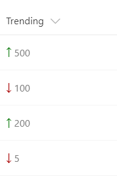

# Show trending up/trending down icons 

## Summary
This example relies on two number fields, `Before` and `After`, for which the values can be compared. It shows the appropriate trending icon next to the `After` field, depending on that field's value compared to the value in `Before`.  `sp-field-trending--up` is used when `After`'s value is higher; `sp-field-trending--down` is used when `After`'s value is lower.

## Sample

Solution|Author(s)
--------|---------
number-trending-icon.json | SharePoint Team

## Version history

Version|Date|Comments
-------|----|--------
1.0|November 2, 2017|Initial release

## Disclaimer
**THIS CODE IS PROVIDED *AS IS* WITHOUT WARRANTY OF ANY KIND, EITHER EXPRESS OR IMPLIED, INCLUDING ANY IMPLIED WARRANTIES OF FITNESS FOR A PARTICULAR PURPOSE, MERCHANTABILITY, OR NON-INFRINGEMENT.**

---

## Additional notes
This sample is also covered in the main documentation around the Column Formatting

- [Use column formatting to customize SharePoint](https://docs.microsoft.com/en-us/sharepoint/dev/declarative-customization/column-formatting)

