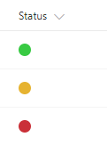

# Traffic Light (Red-Yellow-Green) Status Indicator

## Summary
This example displays a traffic light style (Red-Yellow-Green) status indicator based on the value of a choice column.

## Sample

Solution|Author(s)
--------|---------
text-ryg-status-indicator.json | Travis Lingenfelder

## Version history

Version|Date|Comments
-------|----|--------
1.0|November 27, 2017|Initial release

## Disclaimer
**THIS CODE IS PROVIDED *AS IS* WITHOUT WARRANTY OF ANY KIND, EITHER EXPRESS OR IMPLIED, INCLUDING ANY IMPLIED WARRANTIES OF FITNESS FOR A PARTICULAR PURPOSE, MERCHANTABILITY, OR NON-INFRINGEMENT.**

---

## Additional notes

For more information on using this custom formatting see the article [SharePoint Modern List Traffic Light (Red-Yellow-Green) Status Indicator Column](http://www.constellationsolutions.com/how-to/sharepoint-modern-list-traffic-light-red-yellow-green-status-indicator-column/)

