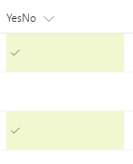

# Formatting Yes/No field to check mark based on the value in the field

## Summary
You can apply conditional formatting to Yes/No fields. The following example applies different classes depending on whether the value of the field is Yes (true), or No (false). This example applies a CSS class (`sp-field-severity--low, sp-field-severity--good`) to the  `
` based on the field's value. Then, it outputs a `` element with an `IconName` attribute. This attribute applies another CSS class to that `` that shows an [Office UI Fabric](https://dev.office.com/fabric#/) icon inside that element.

## Sample

Solution|Author(s)
--------|---------
yesno-checkmark-format.json | Aaron Miao

## Version history

Version|Date|Comments
-------|----|--------
1.0|November 22, 2017|Initial release

## Disclaimer
**THIS CODE IS PROVIDED *AS IS* WITHOUT WARRANTY OF ANY KIND, EITHER EXPRESS OR IMPLIED, INCLUDING ANY IMPLIED WARRANTIES OF FITNESS FOR A PARTICULAR PURPOSE, MERCHANTABILITY, OR NON-INFRINGEMENT.**

---

## Additional notes
If `<input>` tag is supported, it'd be nice to format Yes/No as checkbox. 

