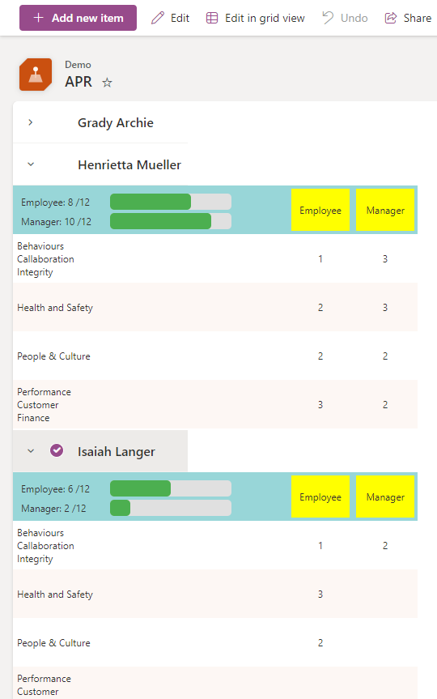
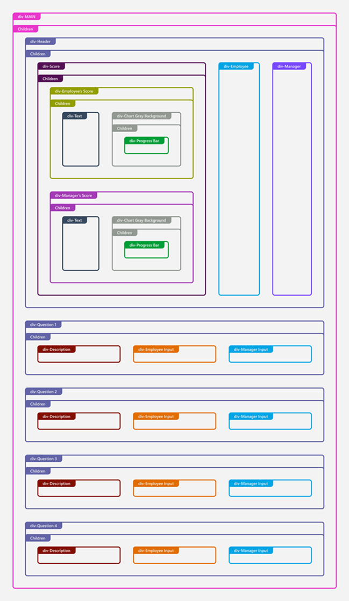

# APR (Annual Performance Review)

## Summary
This sample demonstrates how to change row data to column format for annual performance review form.

This diagram represents the structure of how the list view is displayed. It shows the hierarchical relationship of various elements.

## View requirements

- Group by Employee field in the view settings.
- This format expects the following columns to be part of the view:

Field Name | Required | Type
---------- | -------- | ----
Employee   | Yes      | Person or Group
Manager    | Yes      | Person or Group
Q1e        | No       | Number
Q1m        | No       | Number
Q2e        | No       | Number
Q2m        | No       | Number
Q3e        | No       | Number
Q3m        | No       | Number
Q4e        | No       | Number
Q4m        | No       | Number

## Sample

Solution|Author(s)
--------|---------
apr.json | [Watana](https://github.com/watana2)

## Version history

Version|Date|Comments
-------|----|--------
1.0    |Aug 10, 2024|Initial release

## Disclaimer
**THIS CODE IS PROVIDED *AS IS* WITHOUT WARRANTY OF ANY KIND, EITHER EXPRESS OR IMPLIED, INCLUDING ANY IMPLIED WARRANTIES OF FITNESS FOR A PARTICULAR PURPOSE, MERCHANTABILITY, OR NON-INFRINGEMENT.**

