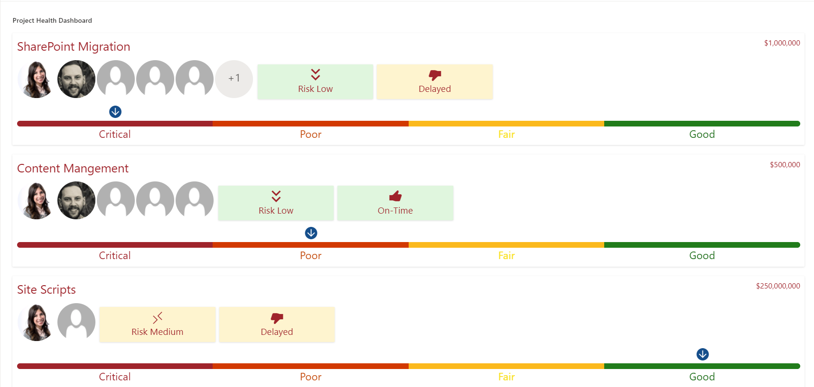
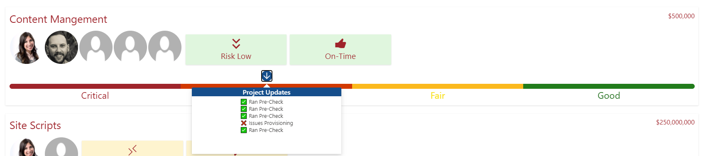

# Project Health Dashboard

## Summary
This is a template for Project health statuses; it has nice features such as Risk scoring, Severity of the project, Schedule timing, Hover effects that provide the latest project updates, Theme Colors, Project Team members, and the cost of the project.

### Hover Display

## View requirements
This format expects the following columns to be part of the view:

|Type|Internal Name|Required|Details|
|---|---|:---:|---|
|Single line of text|Title|Yes|
|Mulit-Person|ProjectMembers|Yes|
|Single line of text|ProjectCost|Yes|
|Number|Risk|Yes|
|Yes/No|OnSchedule|Yes|
|Choice|Severity|Yes|Critical, Poor, Fair, Good|

## Sample

Solution|Author(s)
--------|---------
project-health-dashboard.json | [Andres Ibarra](https://twitter.com/riftsan)

## Version history

Version|Date|Comments
-------|----|--------
1.0|December 29, 2020|Initial release

## Disclaimer
**THIS CODE IS PROVIDED *AS IS* WITHOUT WARRANTY OF ANY KIND, EITHER EXPRESS OR IMPLIED, INCLUDING ANY IMPLIED WARRANTIES OF FITNESS FOR A PARTICULAR PURPOSE, MERCHANTABILITY, OR NON-INFRINGEMENT.**

---

## Additional notes

None

