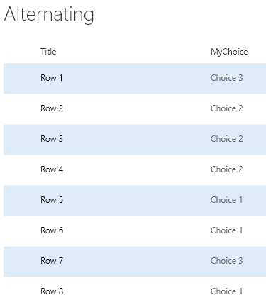
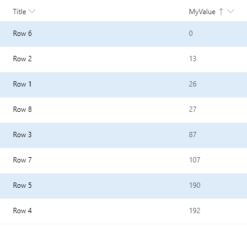
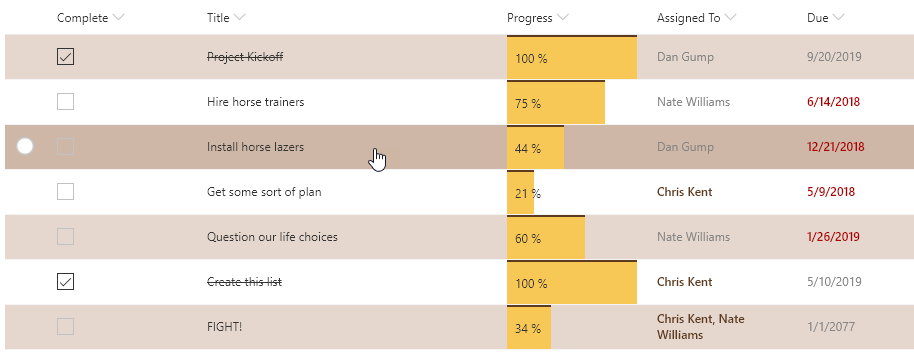

# Alternating Rows

## Summary
Highlights every other row using theme colors.

By usng the `@rowIndex` keyword, the alternating style will be applied regardless of sorting and filtering.

By using the [Office UI Fabric color classes](https://developer.microsoft.com/fabric#/styles/colors) for themes, we can ensure our format looks good in all themes including both light and dark as well as custom themes.

## View requirements
- None, this format will apply to any view!

## Sample

Solution|Author(s)
--------|---------
alternating-rowclass | [Chris Kent](https://twitter.com/thechriskent)

## Version history

Version|Date|Comments
-------|----|--------
1.0|February 19, 2019|Initial release

## Disclaimer
**THIS CODE IS PROVIDED *AS IS* WITHOUT WARRANTY OF ANY KIND, EITHER EXPRESS OR IMPLIED, INCLUDING ANY IMPLIED WARRANTIES OF FITNESS FOR A PARTICULAR PURPOSE, MERCHANTABILITY, OR NON-INFRINGEMENT.**

---

## Additional notes

Because this format is using the `additionalRowClass` property, it can be combined with column formats to make a pretty compelling visualization:

Column Format samples shown above:
- [yesno-checkbox](../../column-samples/yesno-checkbox)
- [text-strikethrough](../../column-samples/text-strikethrough)
- [number-data-bar](../../column-samples/number-data-bar)
- [person-currentuser-format](../../column-samples/person-currentuser-format)
- [date-range-format](../../column-samples/date-range-format)

