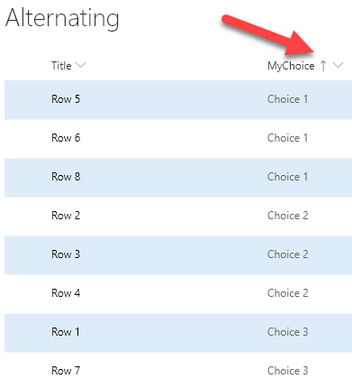

# Alternating Rows

## Summary
Highlights every other row using theme colors.

By usng the `@rowIndex` keyword, the alternating style will be applied regardless of sorting and filtering.

By using the [Office UI Fabric color classes](https://developer.microsoft.com/fabric#/styles/colors) for themes, we can ensure our format looks good in all themes including both light and dark as well as custom themes.

> Note - The alternating row format is now available as a Design Mode wizard for View Formatting. However, this sample uses Excel style syntax (design mode uses AST) and takes advantage of theme colors (rather than the default neutral). The Design Mode wizard is awesome, but there is still value in this sample as well.

## View requirements
- None, this format will apply to any view!

## Sample

Solution|Author(s)
--------|---------
alternating-rows.json | [Chris Kent](https://github.com/thechriskent)

## Version history

Version|Date|Comments
-------|----|--------
1.0|February 19, 2019|Initial release

## Disclaimer
**THIS CODE IS PROVIDED *AS IS* WITHOUT WARRANTY OF ANY KIND, EITHER EXPRESS OR IMPLIED, INCLUDING ANY IMPLIED WARRANTIES OF FITNESS FOR A PARTICULAR PURPOSE, MERCHANTABILITY, OR NON-INFRINGEMENT.**

---

## Additional notes

Because this format is using the `additionalRowClass` property, it can be combined with column formats to make a pretty compelling visualization:

Column Format samples shown above:
- [yesno-checkbox](../../column-samples/yesno-checkbox)
- [text-strikethrough](../../column-samples/text-strikethrough)
- [number-data-bar](../../column-samples/number-data-bar)
- [multi-person-currentuser](../../column-samples/multi-person-currentuser)
- [date-range-format](../../column-samples/date-range-format)

