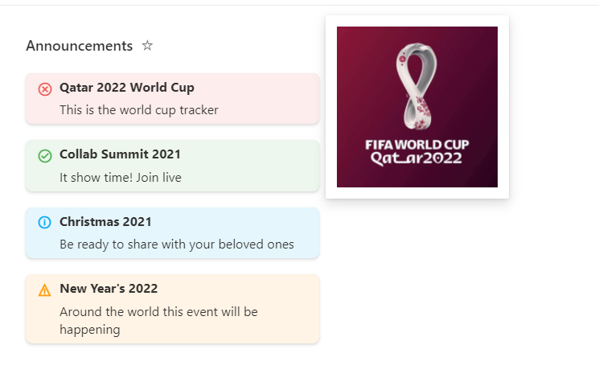
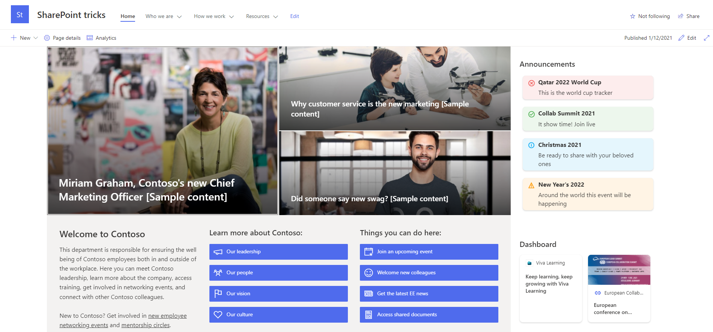

# Announcements

## Summary

This sample formats your view to look like a Announcements card with a similiar style to Viva Connection Cards when on a SharePoint Page. In Microsoft Lists it will also show an image that you can connect with the Announcement.

## View requirements

| Column Name         | Type                                   | Internal Column Name |
| ------------------- | -------------------------------------- | -------------------- |
| Title               | Single Line Text                       | Title                |
| Description         | Single Line Text                       | Description          |
| TypeAnn             | Choice (Error, Success, Info, Warning) | TypeAnn              |
| RemoveDate         | Date and Time                          | RemoveDate          |
| (optional) ImgHover | Image                                | ImgHover             |

## Sample

Solution|Author(s)
--------|---------
announcements.json | [David Ramalho](https://github.com/DRamalho92)

## Version history

| Version | Date               | Comments        |
| ------- | ------------------ | --------------- |
| 1.0     | December 1, 2021   | Initial release |
| 1.1     | September 17, 2023 | The new Image column can now be created, and the use of the Image column is now common when using images. Therefore, changed the type of ImgHover column from Picture column to Image column. |
| 1.2     | November 1, 2024   | Fixed image path and black text for dark theme. |

## Disclaimer

**THIS CODE IS PROVIDED _AS IS_ WITHOUT WARRANTY OF ANY KIND, EITHER EXPRESS OR IMPLIED, INCLUDING ANY IMPLIED WARRANTIES OF FITNESS FOR A PARTICULAR PURPOSE, MERCHANTABILITY, OR NON-INFRINGEMENT.**

