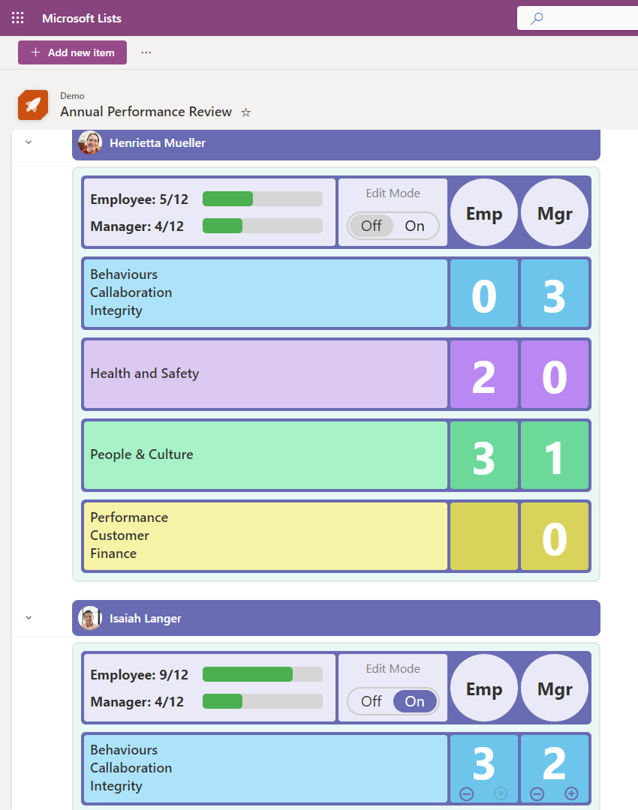
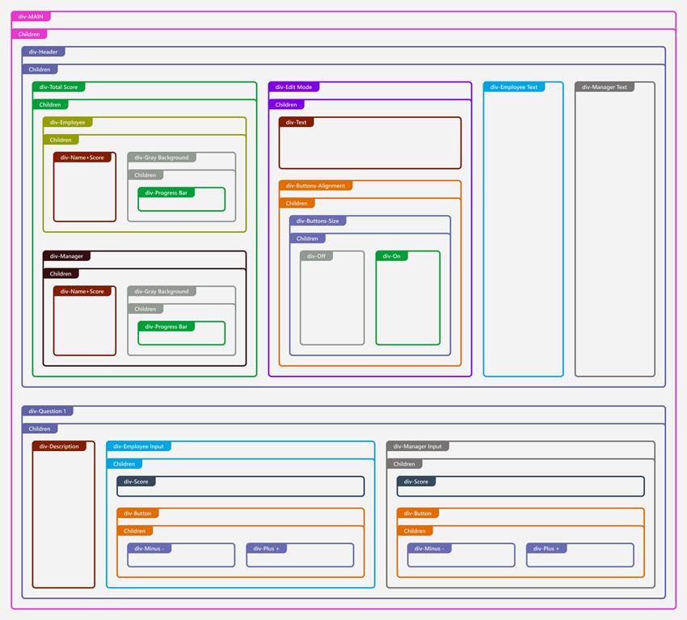

# Annual Performance Review

## Summary

This sample demonstrates how to change row data to column format for annual performance review forms, inspired by list formatting authors of Smart Goal, Elf Progress Board, Display a User's Photo in Group Header, and Rounded fill checkbox.

This diagram represents the structure of how the list view is formatted. It shows the hierarchical relationship of various elements.

> [!NOTE]
> This sample also includes [command bar customization](https://learn.microsoft.com/en-us/sharepoint/dev/declarative-customization/view-commandbar-formatting).

## View requirements

- Group by Employee field in the view settings.
- This format expects the following columns to be part of the view:

Column Name | Required | Type
----------- | -------- | ----
Employee    | Yes      | Person or Group
EditMode    | No       | Yes/No
Q1e         | No       | Number
Q1m         | No       | Number
Q2e         | No       | Number
Q2m         | No       | Number
Q3e         | No       | Number
Q3m         | No       | Number
Q4e         | No       | Number
Q4m         | No       | Number

## Sample

Solution|Author(s)
--------|---------
annual-performance-review.json | [Watana](https://github.com/watana2)

## Version history

Version|Date|Comments
-------|----|--------
1.0    |October 6, 2024|Initial release
2.0    |October 16, 2024|New layout
2.1    |October 24, 2024|Added edit mode switch, fixed border thickness and alignment.

## Disclaimer
**THIS CODE IS PROVIDED *AS IS* WITHOUT WARRANTY OF ANY KIND, EITHER EXPRESS OR IMPLIED, INCLUDING ANY IMPLIED WARRANTIES OF FITNESS FOR A PARTICULAR PURPOSE, MERCHANTABILITY, OR NON-INFRINGEMENT.**

