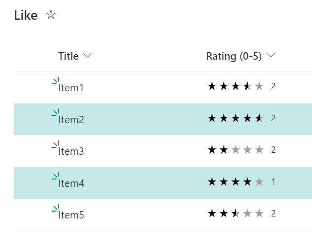

# Average Rating Row Class

## Summary
This sample demonstrates how to change the background color of a row based on Average Rating. In this case, the background color of the row is changed when the Average Rating is 4 or higher.



### Prerequisites
The ratings feature is available by default in the team site, but not in the communication site. If you want to use the ratings feature in the list of communication sites, you need to enable the feature GUID ` 915c240e-a6cc-49b8-8b2c-0bff8b553ed3`. The following is an example of how to enable it using [PnP PowerShell](https://pnp.github.io/powershell).

```
$targetURL = "https://tenent.sharepoint.com/sites/CommunicationSite"
Connect-PnPOnline -Url $targetURL -Interactive
Enable-PnPFeature –identity 915c240e-a6cc-49b8-8b2c-0bff8b553ed3 -Scope site
```

## View requirements
- You need to add a ratings feature to the list and display stars. To add it, please refer to [this page](https://support.microsoft.com/en-us/office/add-a-ratings-feature-to-your-library-5901fcfd-19ca-4f27-a65f-284654298552).

## Sample

Solution                     |Author(s)
-----------------------------|---------------------------
average-rating-rowclass.json |[Tetsuya Kawahara](https://twitter.com/techan_k)

## Version history

Version |Date             |Comments
--------|-----------------|--------------------------------
1.0     |October 20, 2021 |Initial release

## Disclaimer
**THIS CODE IS PROVIDED *AS IS* WITHOUT WARRANTY OF ANY KIND, EITHER EXPRESS OR IMPLIED, INCLUDING ANY IMPLIED WARRANTIES OF FITNESS FOR A PARTICULAR PURPOSE, MERCHANTABILITY, OR NON-INFRINGEMENT.**

## Additional notes
- [PnP PowerShell](https://pnp.github.io/powershell)
- [Add a ratings feature to your library](https://support.microsoft.com/en-us/office/add-a-ratings-feature-to-your-library-5901fcfd-19ca-4f27-a65f-284654298552)

