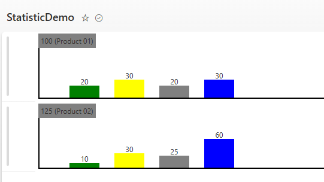

# Bar Chart Diagram - Statistic output

## Summary

This SharePoint JSON formatting script customizes the display of a list view row by rendering a horizontal bar chart directly in the list. For each item, the script reads numeric values from specified columns and draws proportional bars using HTML/CSS styling defined in the JSON. This provides an at-a-glance visual comparison of numbers (like progress, scores, or percentages) without leaving the list view. The formatting follows the SharePoint row formatting schema (v2), ensuring compatibility with modern SharePoint Online lists. This allows you to display a percentage bar chart that is calculated using the total value from the Total column.

## View requirements
Column Name         | Type                   | Setting
--------------------|------------------------|--------
Title               | Single line of text    | -
Value01             | Number                 | without decimals
Value02             | Number                 | without decimals
Value03             | Number                 | without decimals
Value04             | Number                 | without decimals
Total               | Number                 | without decimals

The Title column is used to display a title within the bar chart. Additioanl information, like a legend for each bar, is not rendered. You can provide these information directly on the page in a text web part.
You can alter the count of value columns (Value01 ...). The current JSON-Format print out 4 values. For more you must alter the script. Just duplicate the output for a bar chart.

## Sample Data

| Title        | Value01  |Value02   |Value03  |Value04  |Total
|--------------|----------|----------|---------|---------|-----
| IT Tickets   | 20       |40        |30       |10       |100
| HR Tickets   | 10       |30        |80       |20       |140

> [!NOTE]
> All columns must be included in the view; no special grouped-by or other settings are needed. If you alter the column names, you must adjust the names in the script. In the above example, the columns Values01 to Values04 could represent, e.g., Open, Solved, Closed, or Waiting.

## Sample
Solution|Author(s)
--------|---------
bar-chart-diagram.json | [Marc Andre Schröder-Zhou](https://github.com/maschroeder-z)

## Version history
Version|Date|Comments
-------|----|-
1.0    | February 22, 2026 | Initial release.

## Disclaimer
**THIS CODE IS PROVIDED *AS IS* WITHOUT WARRANTY OF ANY KIND, EITHER EXPRESS OR IMPLIED, INCLUDING ANY IMPLIED WARRANTIES OF FITNESS FOR A PARTICULAR PURPOSE, MERCHANTABILITY, OR NON-INFRINGEMENT.**

