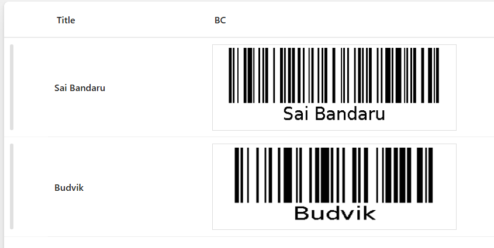

# Bar Code Row Formatter

This sample uses **SharePoint List Formatting** to automatically generate Bar code for each list item based on the Title field.  
Each row displays the item title alongside a dynamically generated Bar code, making it easy to create scannable links or references for physical handouts, inventory tracking, or event management.



## View Requirements

Create a list with the following columns:

| Internal Name   | Type               |
|-----------------|--------------------|
| **Title**       | Single line of text|
| **BC**          | Single line of text|

*Note: Additional columns can be added as needed for your specific use case.*

## Sample Data

| Title                    |
|--------------------------|
| Sai Bandaru              |
| Budvik                   |

## How it Works

- The formatter displays each list item's **Title** with a corresponding **Bar code**
- Bar codes are generated dynamically using the [barcodeapi.org API](https://barcodeapi.org/api/)
- Each Bar code contains the exact text from the **Title** field
- The layout uses a clean horizontal design with proper spacing and alignment
- Bar codes are displayed at 300x100 pixels with a white background and border

## Security Configuration

**CRITICAL**: Before the Bar codes will display, you must configure SharePoint security settings:

1. Navigate to **SharePoint Admin Center**
2. Go to **Settings** > **Advanced Settings**  
3. Find **"HTML Field Security"** section
4. Add `barcodeapi.org` to the **allowed domains** list
5. Save the configuration

**Without this security configuration, Bar codes will not display due to SharePoint's content security policies.**

## Sample

Solution|Author
--------|---------
bar-code.json | [Sai Bandaru](https://github.com/saiiiiiii) ([LinkedIn](https://www.linkedin.com/in/sai-bandaru-97a946153/))

## Version history

Version|Date|Comments
-------|----|--------
1.0|August 29, 2025|Initial release

## Disclaimer
**THIS CODE IS PROVIDED *AS IS* WITHOUT WARRANTY OF ANY KIND, EITHER EXPRESS OR IMPLIED, INCLUDING ANY IMPLIED WARRANTIES OF FITNESS FOR A PARTICULAR PURPOSE, MERCHANTABILITY, OR NON-INFRINGEMENT.**

---

## Additional Notes

### Customization Options

**Use Different Data Source:**
Replace `[$Title]` with any other text field:
```json
"src": "='https://barcodeapi.org/api/' + [$Description]"
```

**Styling Modifications:**
- Adjust spacing: Change `"gap": "50px"` value
- Modify title width: Update `"min-width": "150px"`
- Customize borders and padding as needed

### Use Cases
- **Asset Management**: Generate Bar codes for equipment or inventory items
- **Event Planning**: Create scannable codes for session titles or locations  
- **Document Tracking**: Link physical documents to digital versions
- **Contact Information**: Generate codes for email addresses or phone numbers
- **URL Shortening**: Create Bar codes for long URLs or SharePoint page links

### Limitations
- Requires internet connectivity for Bar code generation
- External dependency on barcodeapi.org API
- Consider data privacy when using external Bar code services
- Performance may vary with large lists due to multiple API calls

## License
This formatting solution is provided as-is for educational and professional use. The barcodeapi.org API has its own terms of service.


