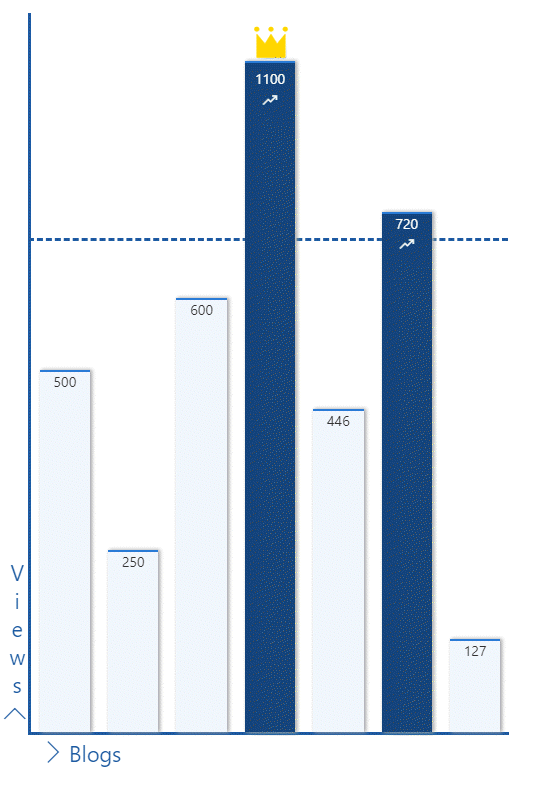

# Bar Graph format

## Summary

This is a sample shows how to format a list to show the data as a bar graph. In this instance we are showing number of views per blog.

The sample features the following:
- Conditionally showing a crown icon if the item is marked as MostRead
- Conditionally showing elements (chart labels) based on `@rowIndex`
- Conditionally showing a trending icon if the item has more than 700 views
- Conditionally changing the colour of the bar if the item has more than 700 views
- Use of theme color classes to ensure the format displays as intended regardless of theme (light, dark, custom, etc.)

## Normal view

## Item Hover view

## View requirements

|Type|Internal Name|Required|
|---|---|:---:|
|Single line of text|Title|Yes|
|Number|Views||
|Yes/No|MostRead||

## Setup

The sample needs the following setup:
- Only one item needs to have `MostRead` as yes

The idea is that this data gets populated via some code so that it can represented as graph.

In the sample, the height of the parent div is set to 800px and the child div use percentage heights. The percentages are calcuated considering 1000 as max number of views. If this number needs changing then please update the formula in lines 92 and 95 accordingly.

## Enhancements

The threshold line at the moment has width set to 35%. This can be changed to be set dynamically based on the number of items.

## Sample

Solution|Author(s)
--------|---------
bar-graph-format | [Anoop Tatti](https://twitter.com/anooptells)

## Version history

Version|Date|Comments
-------|----|--------
1.0|August 15, 2019 |Initial release

## Disclaimer
**THIS CODE IS PROVIDED *AS IS* WITHOUT WARRANTY OF ANY KIND, EITHER EXPRESS OR IMPLIED, INCLUDING ANY IMPLIED WARRANTIES OF FITNESS FOR A PARTICULAR PURPOSE, MERCHANTABILITY, OR NON-INFRINGEMENT.**

---

