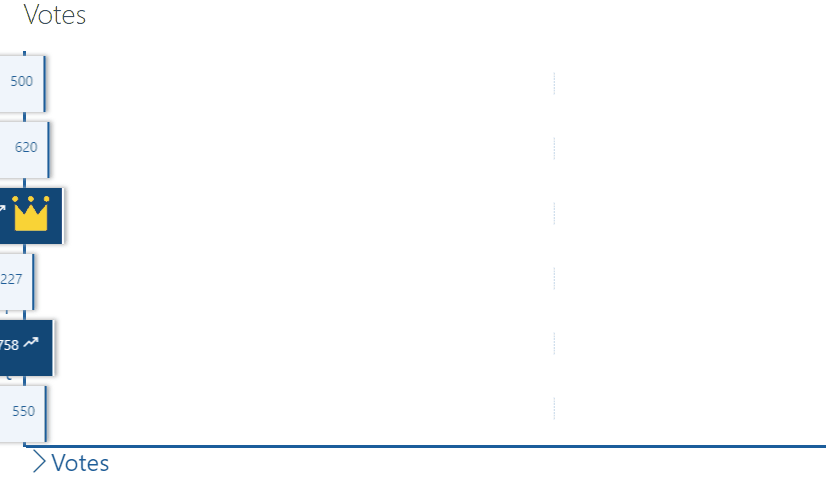
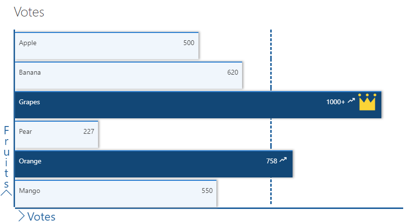

# Bar Graph format

## Summary

This sample shows how to format a list to show the data as a bar graph. In this instance we are showing number of votes per fruit.

The sample features the following:
- If [animate css application customiser](https://github.com/anoopt/spfx-ext-animate-css) is deployed then, this sample adds slide animation to bars.
- Conditionally showing a crown icon if the item is marked as MostVoted
- Conditionally showing elements (trending limit) based on `@rowIndex`
- Conditionally showing a trending icon if the item has more than 700 votes
- Conditionally changing the colour of the bar if the item has more than 700 votes
- Use of theme color classes to ensure the format displays as intended regardless of theme (light, dark, custom, etc.)

## View with animate.css application customiser

## View without animate.css application customiser

## View requirements

|Type|Internal Name|Required|
|---|---|:---:|
|Single line of text|Title|Yes|
|Number|Votes||
|Yes/No|IsLastItem||
|Yes/No|IsHighest||
|Single line of text|Icon||

## Setup

The sample needs the following setup:
- Only one item needs to have `IsHighest` as yes
- Only the last item needs to have `IsLastItem` as yes

The idea is that this data gets populated via some code so that it can represented as a graph.

In the sample, the height of the parent div is set to 800px and the child div calculates heights. The heights are calcuated considering 1000 as the max number of views. If this number needs changed, please update the formulas in lines 50 and 103 accordingly.

## Sample

Solution|Author(s)
--------|---------
bar-graph-format | [Anoop Tatti](https://twitter.com/anooptells)

## Version history

Version|Date|Comments
-------|----|--------
1.0|September 02, 2019 |Initial release

## Improvements
Need to check if a gradient css can also be added to the bars, with an application customiser.

## Disclaimer
**THIS CODE IS PROVIDED *AS IS* WITHOUT WARRANTY OF ANY KIND, EITHER EXPRESS OR IMPLIED, INCLUDING ANY IMPLIED WARRANTIES OF FITNESS FOR A PARTICULAR PURPOSE, MERCHANTABILITY, OR NON-INFRINGEMENT.**

---

