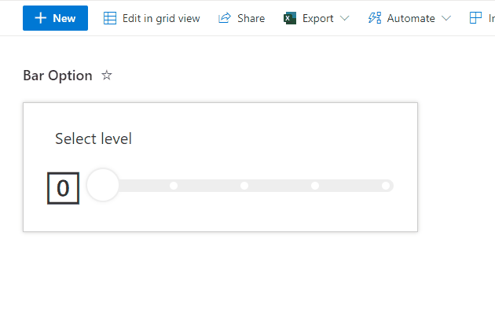

# Bar Option Picker

## Summary
This sample displays a bar with multiple options. When an option on the bar is clicked, the `Value` column is updated to the corresponding value (0-4) using `setValue`.

The value is shown in an icon on the left and the progress bar color is based on the value.

## View requirements
- The format expect the following fields:

Field |Type
--------|---------
Title | Single line of text 
Value | Number - Default value 0

## Sample

Solution|Author(s)
--------|---------
bar-option-picker.json | [André Lage](https://github.com/aaclage)

## Version history

Version|Date|Comments
-------|----|--------
1.0|January 15, 2022|Initial release

## Disclaimer
**THIS CODE IS PROVIDED *AS IS* WITHOUT WARRANTY OF ANY KIND, EITHER EXPRESS OR IMPLIED, INCLUDING ANY IMPLIED WARRANTIES OF FITNESS FOR A PARTICULAR PURPOSE, MERCHANTABILITY, OR NON-INFRINGEMENT.**

