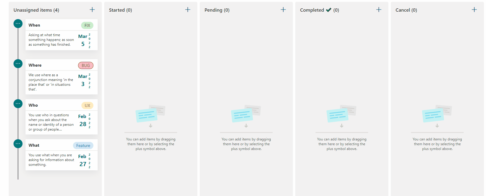

# Board tag format

## Summary
This sample display formatted card in board that allow tag definition, date of card and menu option to define card position in category, share link and include Flag for focus color on card, associate assigned user and minimize/expand Card. 

## View requirements
- The format expect the following fields:

Field |Type
--------|---------
Title | Single line of text.
Description | Multiple lines of text.
Category | Choice - include following values **(Started,Pending,Completed ✔️,Cancel)**.
Date | Date and time - Date of task.
Tag | Choice - include tag names and define format for each choice.
Flag | True/False - include flag and change backgound color of card.
Assigned | Person - Assigned user associated to task.
Expand | True/False - Minimize or expand Card.

## Sample

Solution|Author(s)
--------|---------
board-tag-format.json | [André Lage](https://twitter.com/aaclage)

## Version history

Version|Date|Comments
-------|----|--------
1.0|March 1, 2022|Initial release

## Disclaimer
**THIS CODE IS PROVIDED *AS IS* WITHOUT WARRANTY OF ANY KIND, EITHER EXPRESS OR IMPLIED, INCLUDING ANY IMPLIED WARRANTIES OF FITNESS FOR A PARTICULAR PURPOSE, MERCHANTABILITY, OR NON-INFRINGEMENT.**

