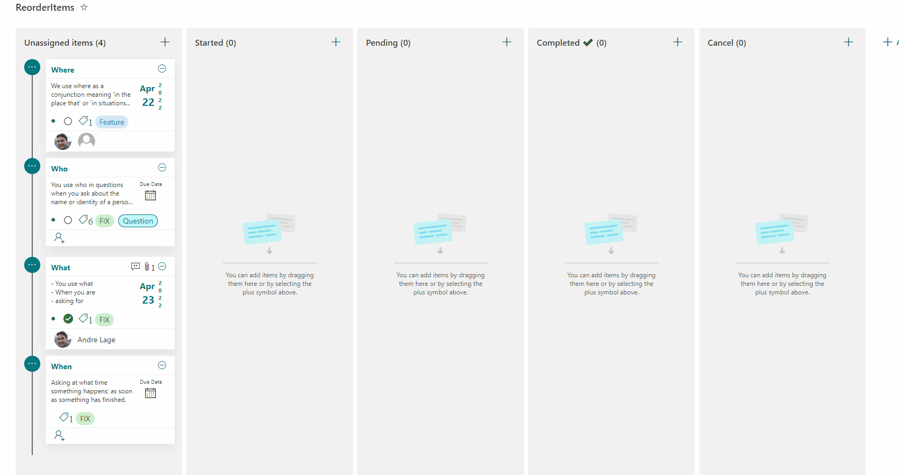
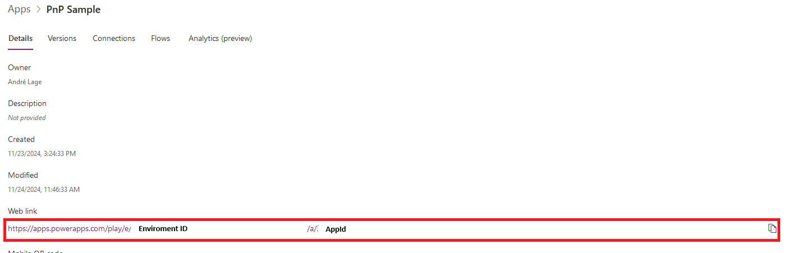
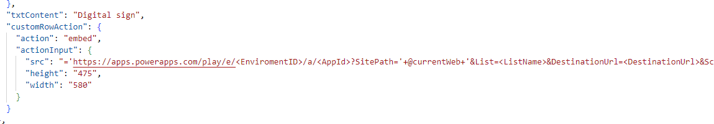

# Board Tags

## Summary
This sample displays a formatted card in a board view that enables tagging, updating card dates, menu options to reorder cards within their category, sharing links, flag (focus colors), assigning a user, and minimizing/expanding the card. 

This List format also uses **embedded** action to open custom Power Apps with parameters for digital signature of user and report generator.

### Board tasks (board-tags.json)

- This List fields formatting try to replicate same behavior/UI from **"Planner"** based on Board view.



### Task cards  (board-tags-cards.json)

- This List fields and formatting try to replicate same behavior/UI  on cards from **"Planner"** for Gallery view.

 

# Configuration of Board tasks (board-tags.json)

## View requirements
- The format expects the following fields:

Field |Type
--------|---------
Title | Single line of text.
Assigned | Person - Assigned user associated to task, allow **multiple selections** of users.
Tag | Choice - include tag names and define format for each choice and allow multiple selections.
Category | Choice - include following values **("Started","Pending","Completed ✔️","Cancel")** and **Started** as default.
Progress | Choice - include following values **("Not Started","In progress","Completed")**.
Priority | Choice - include following values **("Urgent","Important","Medium","Low")** and **Medium** as default.
StartDate | Date and time - Start date of task.
EndDate | Date and time - Due Date of task.
Description | Multiple lines of text.
Flag | True/False - include flag and change background color of card (Default value **False**).
Expand | True/False - Minimize or expand Card (Default value **False**).
Image | Image/Thumbnail - Image of Signature
ReportUrl | Single line of text - Url to Report
Color | Single line of text - Hex Color  used to pass to Power Apps and change color
Attachments | Include default field **"Attachments"** in View to display content 
Editor | Include field **"Modified By"** in View to display content 
Modified | Include field  **"Modified"** in View to display content 


## Create Board View for board-tags.json

- Access to View dropdown and select "**Create new view**".
- Add select option "**Board**", defined **Category** for Buckets grouping and provide name for View.

## Import Power Apps solution "PnPSample.zip" with Flows

Access to Power Apps > Left Menu "Apps" > Top Menu "Import app" > From Package (.zip) > Upload 
- Select **/logicapps/PnPSample.Zip**
- Defined new **Import Setup** for app and flows. 

### Replace Power Apps Url parameters references in board-tags.json

Access to Power Apps > Left Menu "Apps" > Selected app and click 3 dots > Details > Copy Url **EnviromentID** and **AppId**.


Access to **board-tags.json** and access to **Power Apps** url reference and replace tokens:



#### Tokens to replace:
- ```<EnviromentID>``` - Provide enviroment Id
- ```<AppId>``` - Provide App Id 
- ```<ListName>``` - Provide List Name of created. (sample **"Demo"**)
- ```<DestinationUrl>``` - Provide Folder Destination for Report file (sample **"/Shared Documents"**)

### Import Json Format to View

- Access to Board View.
- Edit View > Format Current View. 
- Copy content of file **board-tags.json** and click save.

# Configuration of Task cards  (board-tags-cards.json)

## Create Gallery View for board-tags-cards.json

- User the same List structure defined.
- Access to View dropdown and select "**Create new view**".
- Add select option "**Gallery**", provide name and save.

### Import Json Format to View

- Access to new **Gallery View**.
- Edit View > Format Current View. 
- Copy content of file **board-tags-cards.json** and click save.


## Sample

Solution|Author(s)
--------|---------
board-tags.json | [André Lage](https://github.com/aaclage) ([@aaclage](https://twitter.com/aaclage))
board-tags-cards.json | [André Lage](https://github.com/aaclage) ([@aaclage](https://twitter.com/aaclage))
PnPSample.zip | [André Lage](https://github.com/aaclage) ([@aaclage](https://twitter.com/aaclage))

## Version history

Version|Date|Comments
-------|----|--------
3.0|November 24, 2024|New features with Power Apps feature with signature and display report sample
2.0|April 14, 2022|New features
1.0|March 1, 2022|Initial release

## Support Documentation 

- [Declarative Customization for embedded](https://learn.microsoft.com/en-us/sharepoint/dev/declarative-customization/formatting-syntax-reference#customrowaction)

## List formatting magic - Discussion board formatting
[](https://www.youtube.com/watch?v=KTleK0_66IU)

## List formatting - List embedded integrated with Power Apps
[](https://www.youtube.com/watch?v=s40X1dGu390)

## Disclaimer
**THIS CODE IS PROVIDED *AS IS* WITHOUT WARRANTY OF ANY KIND, EITHER EXPRESS OR IMPLIED, INCLUDING ANY IMPLIED WARRANTIES OF FITNESS FOR A PARTICULAR PURPOSE, MERCHANTABILITY, OR NON-INFRINGEMENT.**


