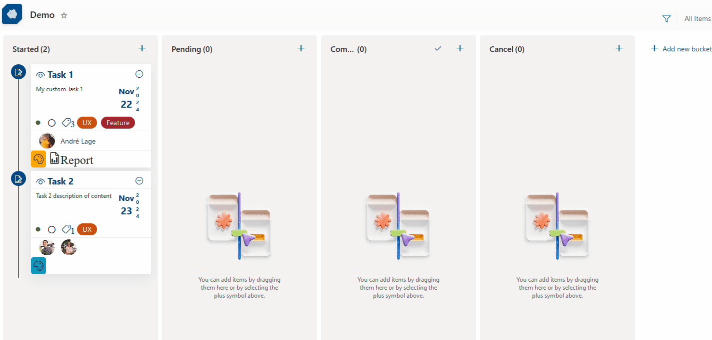

# Board Tags

## Summary
This sample displays a formatted card in a board view that enables tagging, updating card dates, menu options to reorder cards within their category, sharing links, flaging (focus colors), assigning a user, and minimizing/expaning the card.

## View requirements
- The format expects the following fields:

Field |Type
--------|---------
Title | Single line of text.
Description | Multiple lines of text.
Category | Choice - include following values **(Started,Pending,Completed ✔️,Cancel)**.
Date | Date and time - Date of task.
Tag | Choice - include tag names and define format for each choice.
Flag | True/False - include flag and change backgound color of card (Default value **False**).
Assigned | Person - Assigned user associated to task.
Expand | True/False - Minimize or expand Card (Default value **False**).

## Sample

Solution|Author(s)
--------|---------
board-tags.json | [André Lage](https://github.com/aaclage) ([@aaclage](https://twitter.com/aaclage))

## Version history

Version|Date|Comments
-------|----|--------
1.0|March 1, 2022|Initial release

## Disclaimer
**THIS CODE IS PROVIDED *AS IS* WITHOUT WARRANTY OF ANY KIND, EITHER EXPRESS OR IMPLIED, INCLUDING ANY IMPLIED WARRANTIES OF FITNESS FOR A PARTICULAR PURPOSE, MERCHANTABILITY, OR NON-INFRINGEMENT.**

